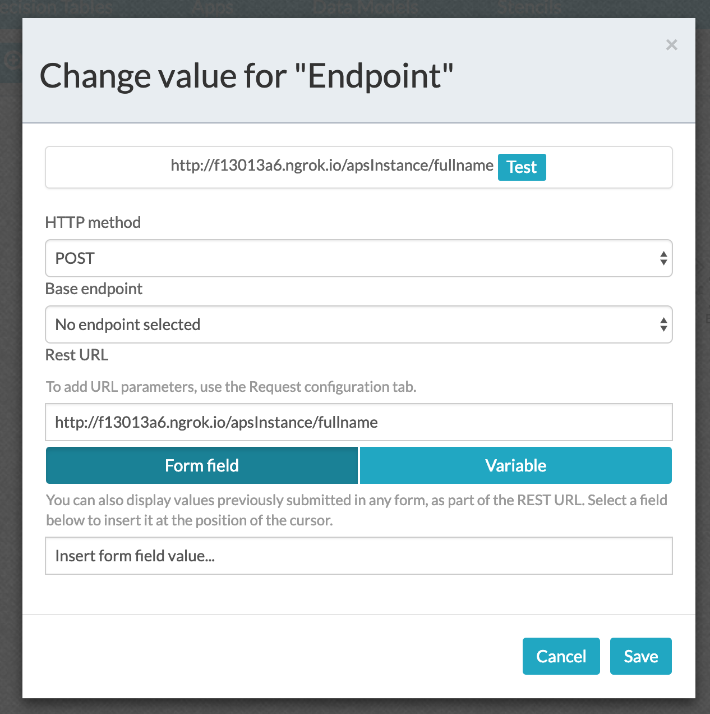

Download and use NGROK `https://ngrok.com/download`in order to create a tunnel and test the REST API calls that are created  in the Spring Boot Application.

```
Command :  ngrok http localhost:8083
Result : Forwarding http://c58d0cb7.ngrok.io -> localhost:8083
Final Action : Use http://c58d0cb7.ngrok.io as hostnames in REST API Endpoints.
```

