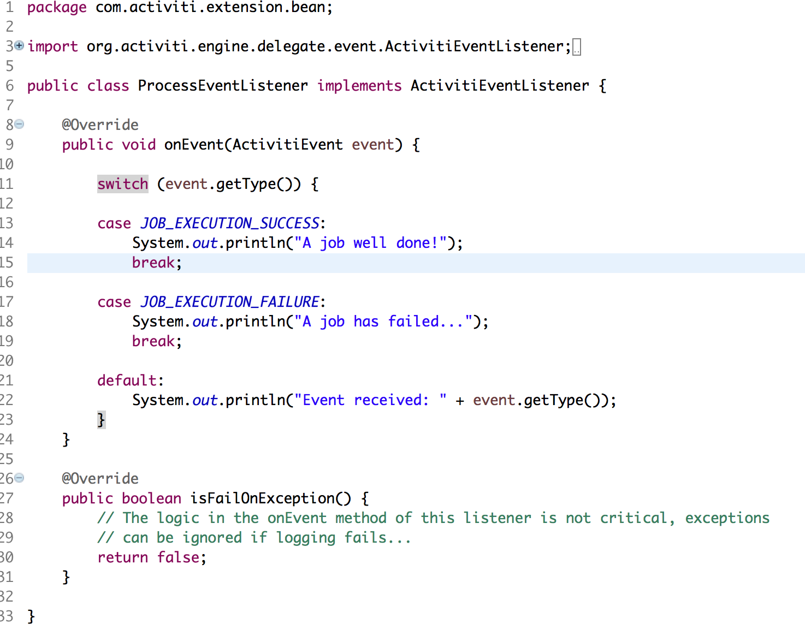

#### The project contains all the components required to create an ACS folder from APS via REST calls

### Use-Case / Requirement
Build a process to create a listener that listens to an event.

### Prerequisites to run this demo end-2-end

* Alfresco Process Services (powered by Activiti) (Version 1.9 and above) - If you don't have it already, you can download a 30 day trial from [Alfresco Process Services (APS)](https://www.alfresco.com/products/business-process-management/alfresco-activiti).Instructions & help available at [Activiti Docs](http://docs.alfresco.com/activiti/docs/), [Alfresco BPM Community](https://community.alfresco.com/community/bpm)

## Configuration Steps

### Activiti Setup and Process Deployment
1. Import the  app available in this project into Activiti.
2. Process Flow.  
3. Process Configuration. 
4. Task Configuration   
5. Event Listener Task Configuration 
6. Code Snippet. 
7. Source Code. 
8. The JAR File. 
9. Copy the jar file to tomcat-lib location. eg: /usr/local/tomcat/webapps/activiti-app/WEB-INF/lib/ 
10. Publish/Deploy the APS App.

### Run the DEMO

### References
1. https://www.activiti.org/userguide/#eventDispatcherListener
2. https://grokonez.com/java-integration/activiti-event-listener-spring-boot-example