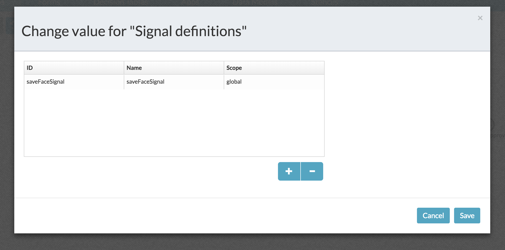

#### The project contains all the components required to trigger a boundary message event using REST calls

### Use-Case / Requirement
A serial approval pipeline process with two-levels. The tasks approved by first-level approver should route to task-list of second-level approver (Manager). The first-level approver should also have the capability to revert/recall the submitted tasks. Thus recalled tasks should be closed/moved out from second-level approver's (Manager) task-list and requeued back to first-level approver's inbox, without any loss of data.


### Prerequisites to run this demo end-2-end

* Alfresco Process Services (powered by Activiti) (Version 1.9 and above) - If you don't have it already, you can download a 30 day trial from [Alfresco Process Services (APS)](https://www.alfresco.com/products/business-process-management/alfresco-activiti).Instructions & help available at [Activiti Docs](http://docs.alfresco.com/activiti/docs/), [Alfresco BPM Community](https://community.alfresco.com/community/bpm)


## Configuration Steps

### Activiti Setup and Process Deployment
1. Setup Alfresco Activiti if you don't have one already. Instructions & help available at [Activiti Docs](http://docs.alfresco.com/activiti/docs/), [Alfresco BPM Community](https://community.alfresco.com/community/bpm)
2. Import the  app available in this project into Activiti.
3. The process flow.  
4. The process configuration. 
5. The boundary signal event. 
6. The signal event definition. 
7. Publish/Deploy the App.

### POSTMAN
1. Use POSTMAN to make REST calls and trigger the Boundary Signal Events.
2. As the first step, REST GET call should be to get the Execution ID of the targeted Boundary Signal Event.
```
http://<hostname>:<port>/activiti-app/api/runtime/executions?tenantId=<tenantId>&processInstanceId=<instanceID>
```
The configuration is shown below. 
If necessary, the value of Execution ID can be cross-verified by querying the DB.


3. As the second step, REST PUT call should send trigger for Boundary Signal Event.
```
http://<hostname>:<port>/activiti-app/api/runtime/executions/<execution-id-of-boundary-signal-event>?tenantId=<tenantId>
```
The header of PUT call is as follows:
```
Authorization = Basic xxxxxxxxxxxxxxx
cache-control = no-cache
content-type = application/json
```
The body of the PUT call is as follows: 
```
{
"action":"signalEventReceived",
"signalName":"saveFaceSignal"
}
```
The configuration is shown below. 

### Run the DEMO

### References
https://www.activiti.org/userguide/index.html#restQueryVariable
https://www.activiti.org/userguide/index.html#restExecutionsGet
http://localhost:3000/activiti-app/api-explorer.html#/

