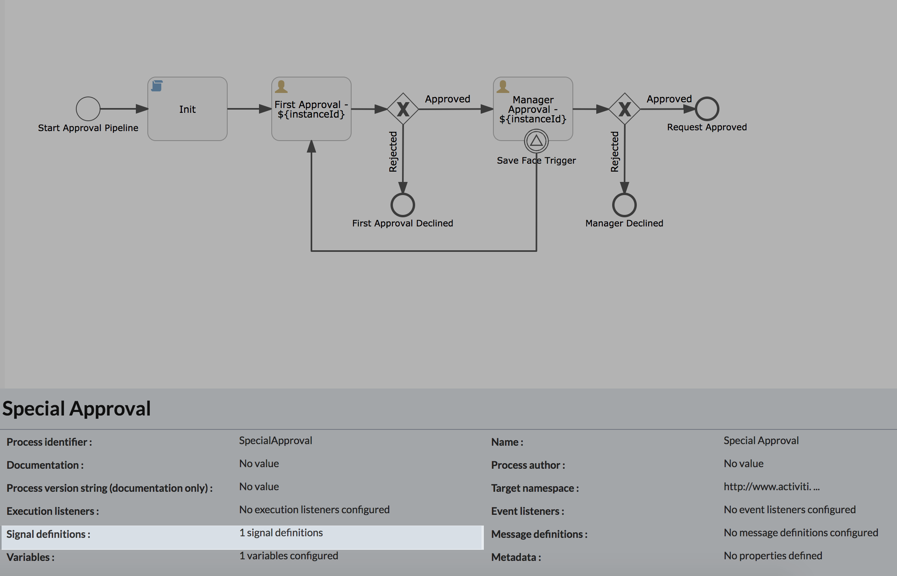
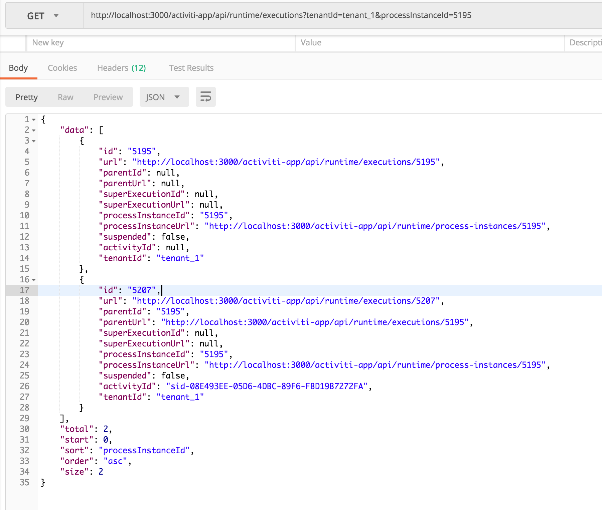
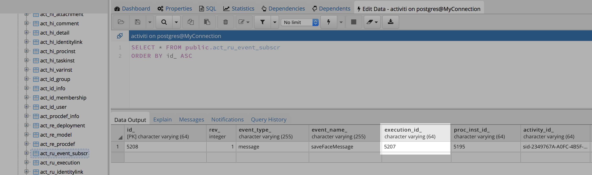
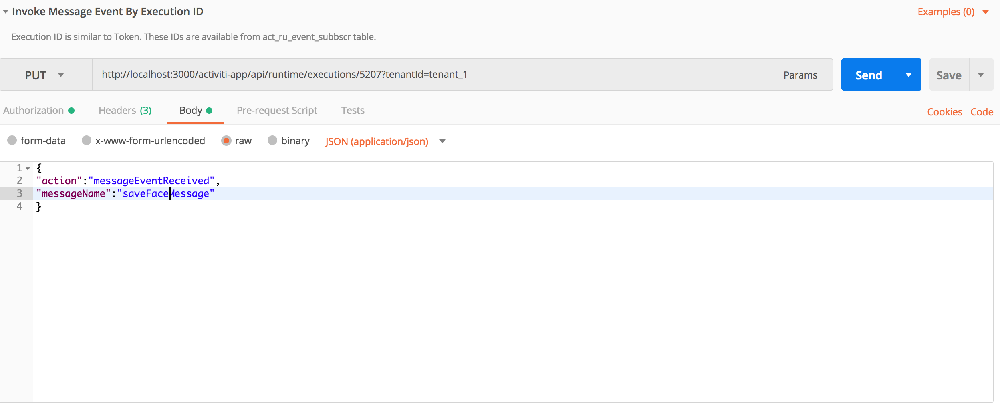

#### The project contains all the components required to trigger a boundary message event using REST calls


### Prerequisites to run this demo end-2-end

* Alfresco Activiti Enterprise (Version 1.9 and above) - If you don't have it already, you can download a 30 day trial from [Alfresco Activiti](https://www.alfresco.com/products/business-process-management/alfresco-activiti)


## Configuration Steps

### Activiti Setup and Process Deployment
1. Setup Alfresco Activiti if you don't have one already. Instructions & help available at [Activiti Docs](http://docs.alfresco.com/activiti/docs/), [Alfresco BPM Community](https://community.alfresco.com/community/bpm)
2. Import the Save-Face.zip(Save-Face.zip) app available in this project into Activiti.
3. The process flow.  
4. The process configuration. 
5. The boundary message event. 
6. The message event defenition. 
7. Publish/Deploy the App.

### POSTMAN
1. Use POSTMAN to make REST calls and trigger the Boundary Message Events.
2. As the first step, REST GET call should be to get the Execution ID of the targeted Boundary Message Event.
http://<hostname>:<port>/activiti-app/api/runtime/executions?tenantId=<tenantId>&processInstanceId=<instanceID>

The configuration is shown below. 
If necessary, the value of Execution ID can be cross-verified by querying the DB.


3. As the second step, REST PUT call should send trigger for Boundary Message Event.
http://<hostname>:<port>/activiti-app/api/runtime/executions/<execution-id-of-boundar-message-event>?tenantId=<tenantId>
The header of PUT call is as follows:
```
Authorization = Basic xxxxxxxxxxxxxxx
cache-control = no-cache
content-type = application/json
```
The body of the PUT call is as follows: 
```
{
"action":"messageEventReceived",
"messageName":"saveFaceMessage"
}
```
The configuration is shown below. 

### Run the DEMO
