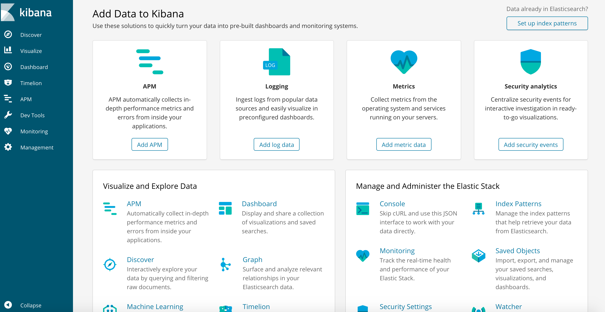
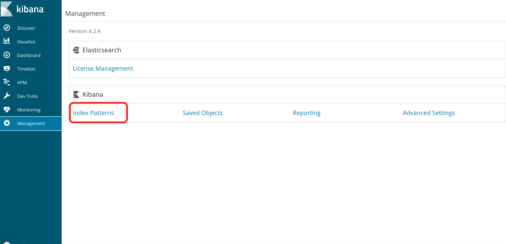
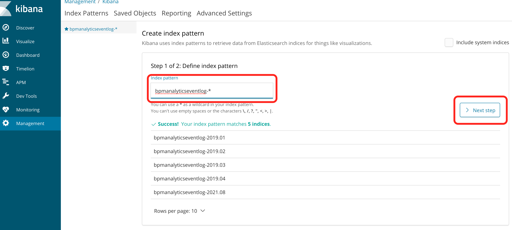
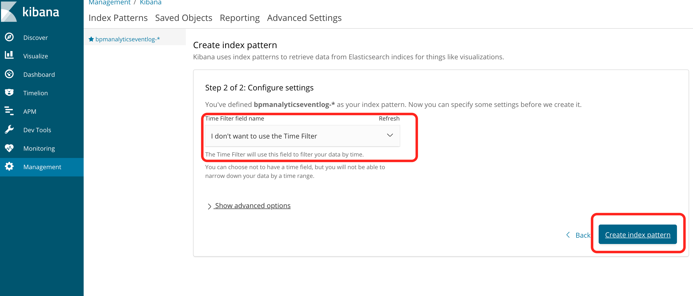
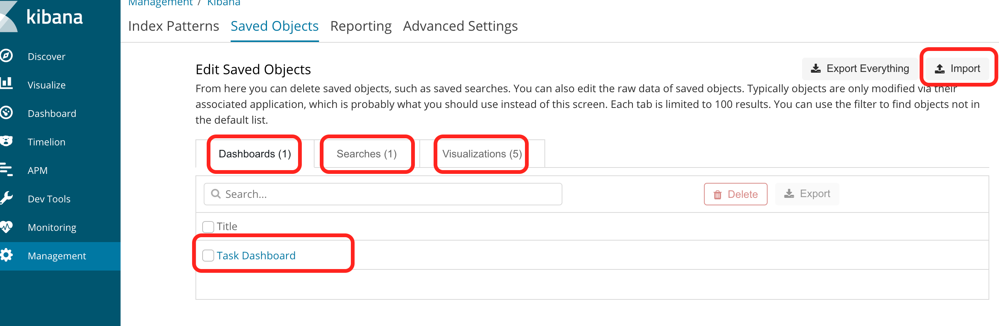
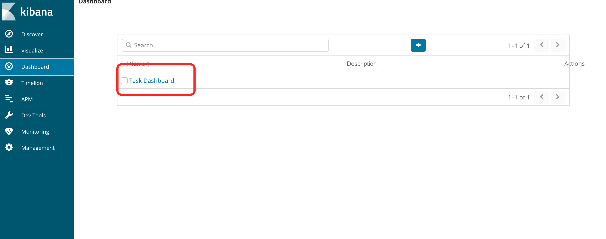
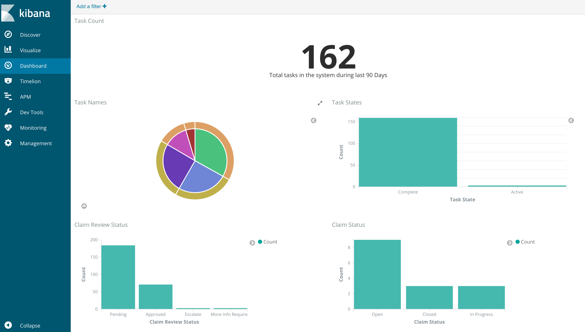

#### The project contains all the components required to build custom reports using Kibana and ElasticSearch

## Use-Case / Requirement
Custom dashboards in Kibana should be built using APS, Kibana and ElasticSearch :

> **Note**: Full credits and thanks to [Ciju Joseph](https://github.com/cijujoseph) for building this spring-boot application. More details are available at https://github.com/cijujoseph/activiti-analytics-spring-boot.

## Prerequisites to run this demo end-2-end

* Alfresco Process Services (powered by Activiti) (Version 1.9 and above) - If you don't have it already, you can download a 30 day trial from [Alfresco Process Services (APS)](https://www.alfresco.com/products/business-process-management/alfresco-activiti).Instructions & help available at [Activiti Docs](http://docs.alfresco.com/activiti/docs/), [Alfresco BPM Community](https://community.alfresco.com/community/bpm)
* Kibana
* ElasticSearch

## Configuration Steps
### 1. Launch an EC2 Instance from an AMI Image
Orca users has to use following AMI Image to lanuch an instance.
```
AMI Name : jwhyte_orca_3.2.2
AMI Id : ami-0617702d4f0917a5a
```

### 2. Login to Okta and Start containers
Orca users has to login after instance is launched.
```
./orca.py login okta
./orca.py start
```

### 3. Prepare APS Container
1. Orca users should upload the latest APS license.
```
Login as admin@app.activiti.com/Alfresco01 to upload the APS license.
```
2. Download and backup the APS Process Apps.
[A few examples are available here.](assets/APS-apps)


### 4. Rebuild ACS Container (Optional Step)
Orca users who see the Orange color community login page has to destroy db containers using the following command.
```
./orca.py destroy db -f

P.S : 
* All the ACS, APS and Analytics data will be erased upon destroying the db container.
* Hence the process container also has to be destroyed and rebuilt. 
    ./orca.py destroy process -f
    ./orca.py start process
* Import the already backed up Process Apps to the newly built process contianer.
```

### 5. Prepare ElasticSearch Container
Orca users can start the ElaticSearch container by running the following command.
```
./orca.py start elasticsearch
```

### 6. Prepare Kibana Container
Orca users can start the Kibana container by running the following command.
```
./orca.py start kibana
```

### 7. Prepare Analytics Container
1. Orca users can start the Analytics container by running the following command.
```
./orca.py start analytics
```

2. Copy the [analytics.jar](assets/activiti-analytics-spring-boot-1.0.0-SNAPSHOT.jar) file into `orca/data` folder.
```
Command:
scp -i my-key.pem activiti-analytics-spring-boot-1.0.0-SNAPSHOT.jar ec2-user@ec2-1-2-3-4.compute-1.amazonaws.com:/home/ec2-user/orca/data
```
> **Note**: Full credits and thanks to [Ciju Joseph](https://github.com/cijujoseph) for building this spring-boot application. More details are available at https://github.com/cijujoseph/activiti-analytics-spring-boot. 


3. Note the id of Analytics container
```
Run ./orca.py status and get the container-id
e.g: orca_analytics_1_99108e53455e
```

4. Copy the [analytics.jar](assets/activiti-analytics-spring-boot-1.0.0-SNAPSHOT.jar) file from `orca/data` into `analytics` container.

```
Command:
docker cp data/activiti-analytics-spring-boot-1.0.0-SNAPSHOT.jar orca_analytics_1_99108e53455e:/opt/analytics/activiti-analytics-spring-boot-1.0.0-SNAPSHOT.jar
```

5. Restart `analytics` container.
```
Command:
./orca.py restart analytics
```

> **Note:** 
Please wait for sometime for the bpmeventlog index to be created. If it takes <b>more than 15 minutes</b>, restart <b>db</b> container, to restart the indexing.


### 8. Prepare Kibana Dashboard
1. Go to Kibana Homepage.
   ``` http
   http://<my-hostname>:5601
   ```
   
2. Select `Management > Index Patterns`
   
3. Create the `Index Pattern` of name `bpmanalyticseventlog-*`
   
   
4. Select `Management > Saved Objects`
5. Select `Import` and import the following JSON
    * [task-dashboard-kibana.json](assets/task-dashboard-kibana.json)
    * [task-search-kibana.json](assets/task-search-kibana.json)
    * [kibana-import-everything.json](assets/kibana-import-everything.json)
   
6. Select `Dashboard` and the `Task Dashboard`
   
   

> **Note:** As required by use cases, more custom visualisations and dashboards can also be created to display business data.

## Run the DEMO

## References
1. https://github.com/cijujoseph/activiti-analytics-spring-boot
2. https://www.tutorialspoint.com/elasticsearch/elasticsearch_query_dsl.htm
3. https://www.bmc.com/blogs/elasticsearch-commands/
