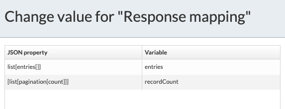

#### The project contains all the components required to create an ACS folder from APS via REST calls

### Use-Case / Requirement

Build a process to create a folder in the ACS repo with some metdata.

### Prerequisites to run this demo end-2-end

* Alfresco Process Services (powered by Activiti) (Version 1.9 and above) - If you don't have it already, you can download a 30 day trial from [Alfresco Process Services (APS)](https://www.alfresco.com/products/business-process-management/alfresco-activiti).Instructions & help available at [Activiti Docs](http://docs.alfresco.com/activiti/docs/), [Alfresco BPM Community](https://community.alfresco.com/community/bpm)

## Configuration Steps

### Activiti Setup and Process Deployment

1. Import the [ACS-File-Creator.zip](ACS-File-Creator.zip) app available in this project into Activiti.
2. The process flow.  
3. The REST CAll configuration. 
4. The Request Mapping Configuration. 

  ```javascript
  {
   "name":${foldername},
   "nodeType":"cm:folder",
   "properties":
   {
    "cm:title":${title},
    "cm:description":${description}
   }
  }
  ```

5. The APS Endpoint configuration for REST call. <br/>
6. Publish/Deploy the App.
7. An example of response mapping is below.<br/>
 

### Run the DEMO


### References

1. <https://api-explorer.alfresco.com/api-explorer/#!/nodes/createNode>
2. <https://community.alfresco.com/community/ecm/blog/2016/10/24/v1-rest-api-part-3-creating-nodes>
3. <https://api-explorer.alfresco.com/api-explorer/#!/nodes/createNode>
