#### The project contains all the components required to build an integration between APS and DocuSign

## Use-Case / Requirement

As part of APS workflow, documents should be electronically signed using DocuSign  :

## Prerequisites to run this demo end-2-end

* Alfresco Process Services (powered by Activiti) (Version 1.9 and above) - If you don't have it already, you can download a 30 day trial from [Alfresco Process Services (APS)](https://www.alfresco.com/products/business-process-management/alfresco-activiti).Instructions & help available at [Activiti Docs](http://docs.alfresco.com/activiti/docs/), [Alfresco BPM Community](https://community.alfresco.com/community/bpm)
* [DocuSign Developer Account](https://developers.docusign.com/)
* [Postman](https://www.postman.com/downloads/)

## Configuration Steps

### 1. Login to DocuSign Developer Account

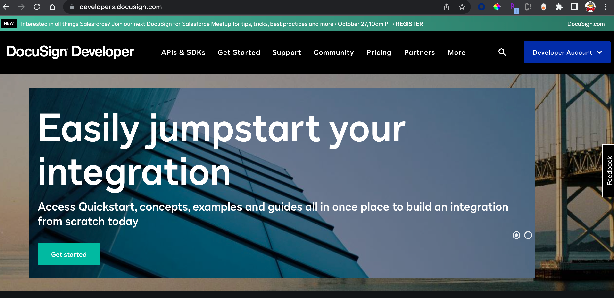

### 2. Configure an Application in DocuSign Developer Account

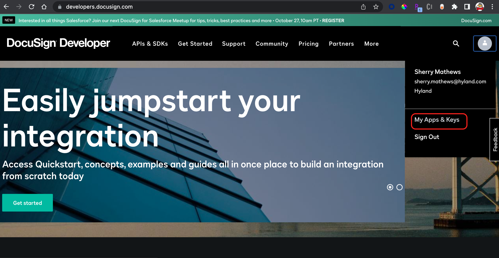

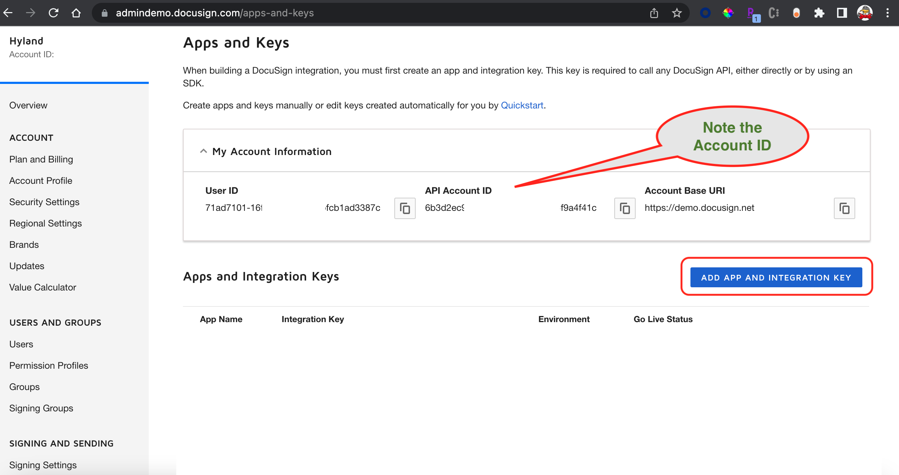

> Note down the `API Account ID`

Create an App by clicking the `Add App and Integration Key` button.

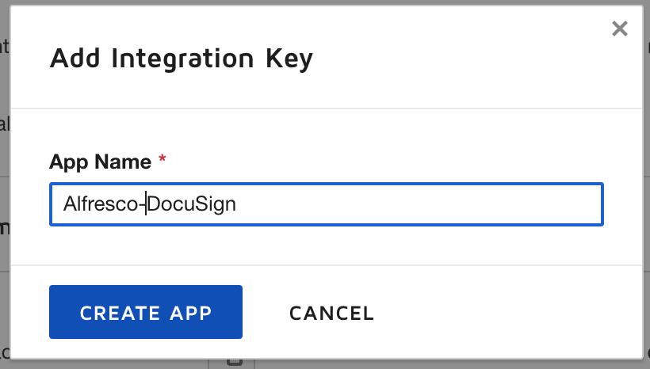

Create the App.

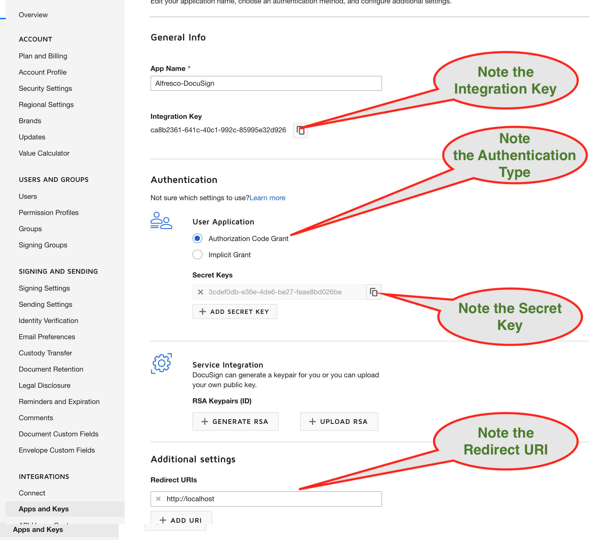

``` html
Note down the following :

* Secret Key
* Integration Key
* Redirect URI
* Authentication Type

```

Click Save and the DocuSign App will be created.

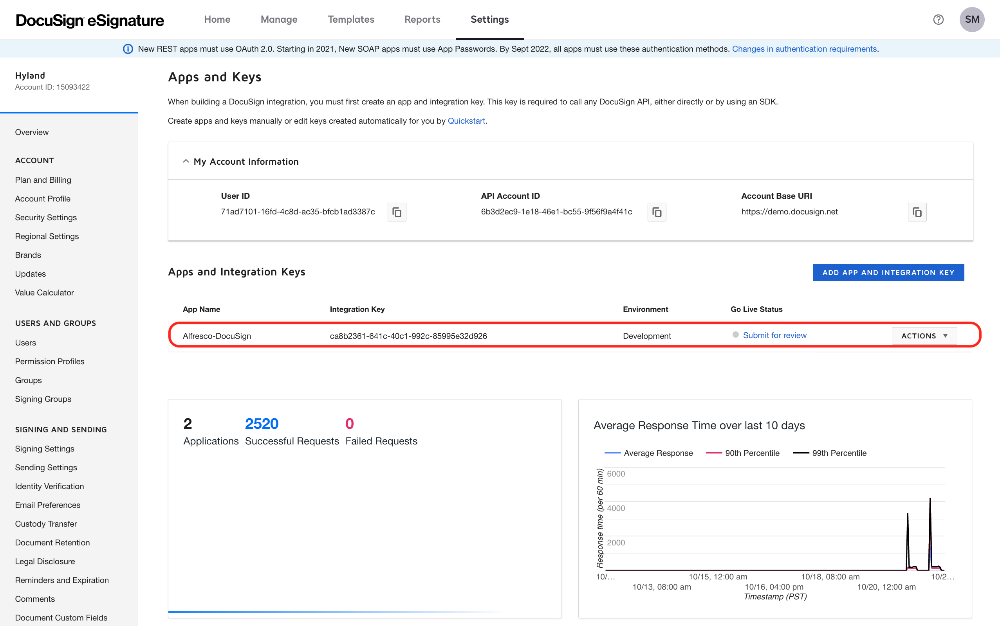

### 3. Select DocuSign Authentication Type

Docusign provides different options for authentication.

>More details are available at the [DocuSign Documentation site](https://developers.docusign.com/platform/auth/).

This article uses `Authorization Code Grant` as the type of authentication.

### 4. Generate Authorization Code

As we use `Authorization Code Grant` for authentication, it requires the `Authorization Code` to be generarted. Please follow these steps to generate the code.

Lets build a URL using the `Integration Key` and `Redirect URI` that we've already noted down.

>Official Documentation is available at [DocuSign Documentation site](https://developers.docusign.com/platform/auth/authcode/authcode-get-token/).

Syntax :

```
https://account-d.docusign.com/oauth/auth?response_type=code&scope=signature%20impersonation&client_id=<integration-key>&redirect_uri=<rerdirect-uri>
```

Example:

```
https://account-d.docusign.com/oauth/auth?response_type=code&scope=signature%20impersonation&client_id=ca8b2361-1234-1234-1234-85995e32d926&redirect_uri=http://localhost
```

Paste the above URL in a browser.
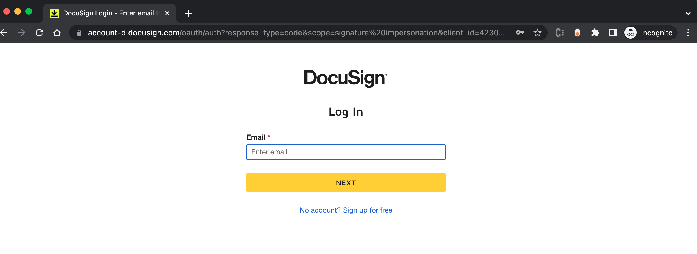

* DocuSign Developer Account credentials have to be provided.
* Enter the code that was send to the registered email.
* Approve further browser popups asking for additional approvals (Approve/Deny), if any.

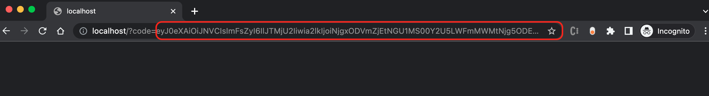

Once authenticated into Developer Account, the URL will change and `AUTHORIZATION CODE` will be part of the URL.

> Note down the `AUTHORIZATION CODE`.

> The `AUTHORIZATION CODE` will expire in 2 minutes. Within that time, it should be used to generate the `ACCESS TOKEN`

### 5. Generate the ENCODED KEY in POSTMAN

Encoded Key has to be generated using the `Integration Key` and `Secret Key` that we've already noted down.

Syntax : `<integration-key>`:`<secret-key>`<br/>
Example : `ca8b2361-1234-1234-1234-85995e32d926`:`3cdef0db-1234-1234-1234-feae8bd026be`

Create a GET request in POSTMAN<br/>

* URL : <http://www.google.com><br/>
* Pre-Request Script:

   ``` javascript
   console.log(' BTOA >>> ',btoa('ca8b2361-1234-1234-1234-85995e32d926:3cdef0db-1234-1234-1234-feae8bd026be'))
   ```

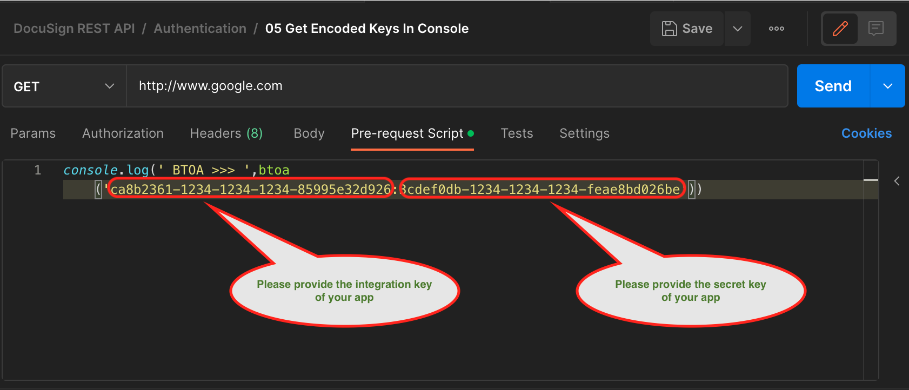

Check the POSTMAN console (at the bottom of window) for Encoded Key.
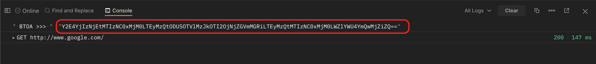

> Note down the `ENCODED KEY`.

If needed, you can decode the Encoded Key [at this website](https://www.base64decode.org/) to verify its accurracy.

### 6. Generate the ACCESS TOKEN using Authorization Code in POSTMAN

Required Values:

* Authorization Code (from Step # 4)
* Encoded Key (from Step # 5)

> Host Name for POSTMAN URL is `account-d.docusign.com`

Import (Right Click > Save Link As) the [global variables available here](assets/workspace.postman_globals.json).

Import (Right Click > Save Link As) and Run the [postman collection available here](assets/DocuSign%20API.postman_collection.json).

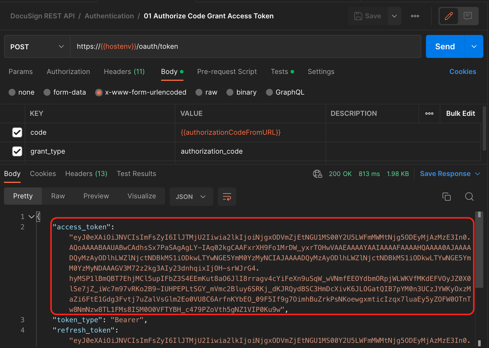

> Note down the `ACCESS TOKEN`.

> The `ACCESS TOKEN` will expire in 30 minutes. Within that time, it should be used in APS Endpoint and Demo Execution.

### 7. Configure APS Endpoint for DocuSign

Required Values :

* Token (from Step # 6)
* API Account ID (from Step # 2)

Navigate to `Endpoints` after clicking `Tenants`

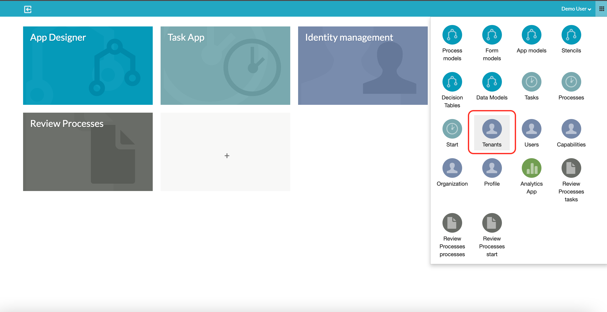

Please Note :

* The order of the Headers should not be changed, as the script in the process goes by order. This can be modified later.

* The order of Headers should be as follows :
  1. Authorization
  2. Content-Type
  3. DocuSignAccountID

* `Authorization` Header value should use `Bearer` appended to Token generated from Step # 6.

* `Content-Type` Header value should use `application/json`.

* `DocuSignAccountID` Header value should use API Account ID from Step # 2.

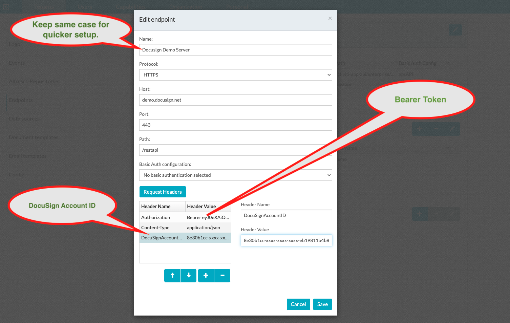

Save entry to add the Endpoint.

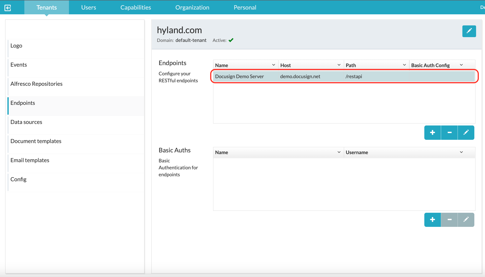

### 8. Import the APS Process App

Import and Publish the APS Process App [available here](assets/DocuSign-APS.zip).

## Run the DEMO

## References

1. DocuSign API - Postman Collection : <https://docusign.github.io/postman-collections/>
2. Docusign Account Types : <https://support.docusign.com/s/articles/Free-account-vs-Developer-account?language=en_US&rsc_301>
3. DocuSign Authentications : <https://developers.docusign.com/platform/auth/>
4. Get Token from Authorization Code Grant : <https://developers.docusign.com/platform/auth/authcode/authcode-get-token/>
5. Access Token Endpoint : <https://developers.docusign.com/platform/auth/reference/obtain-access-token/>
6. Docusign FAQ : <https://support.docusign.com/s/articles/DocuSign-Developer-FAQs-General-Administration-and-Authentication?language=en_US&rsc_301>
7. Docusign Developer Account : <https://developers.docusign.com/>
8. Decode The Base64 Encoding : <https://www.base64decode.org/>
