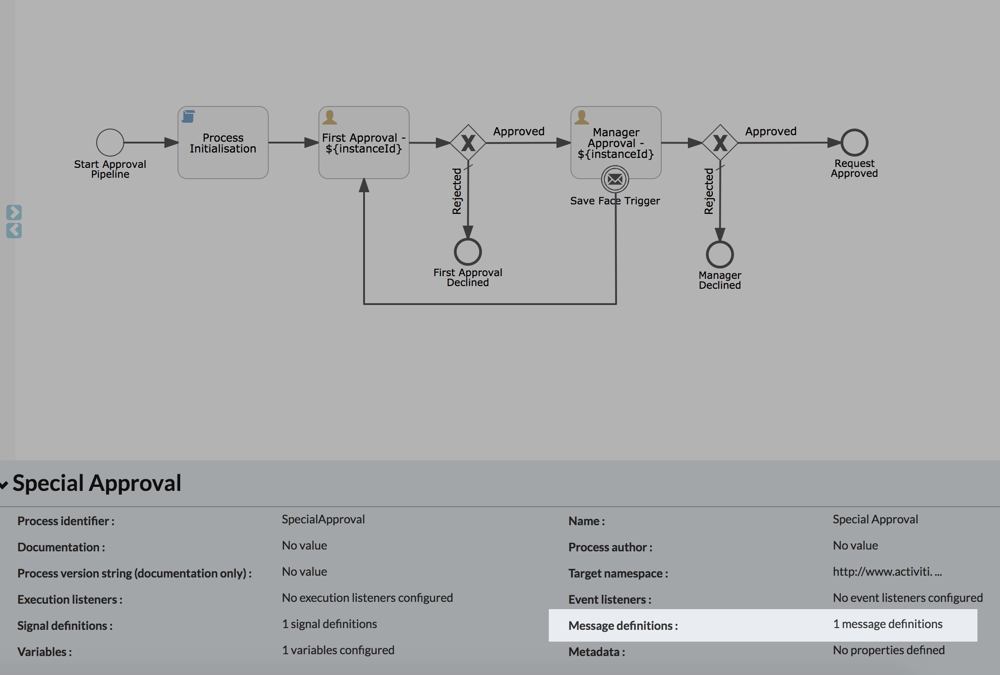
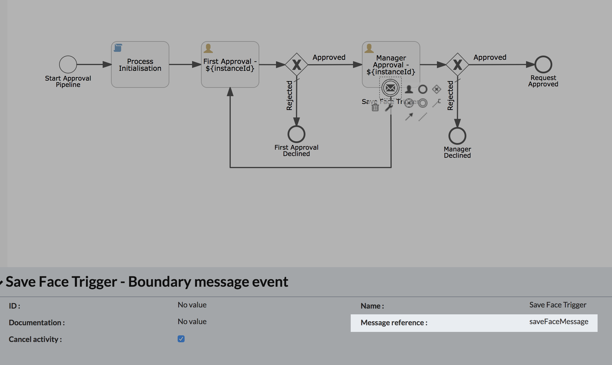
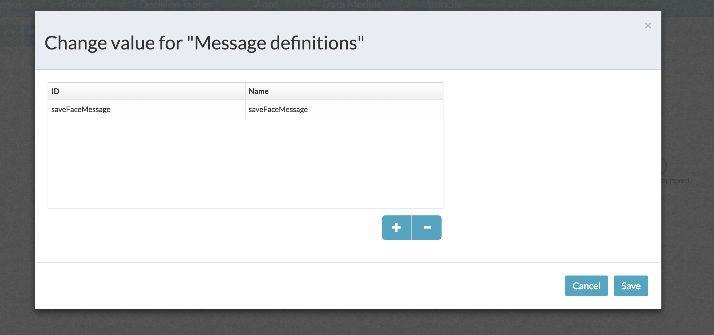
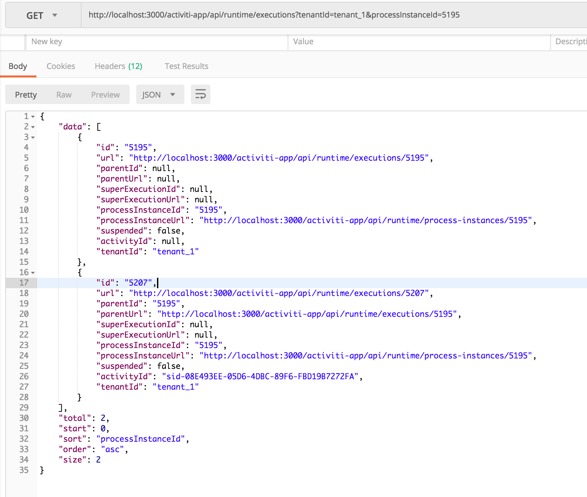
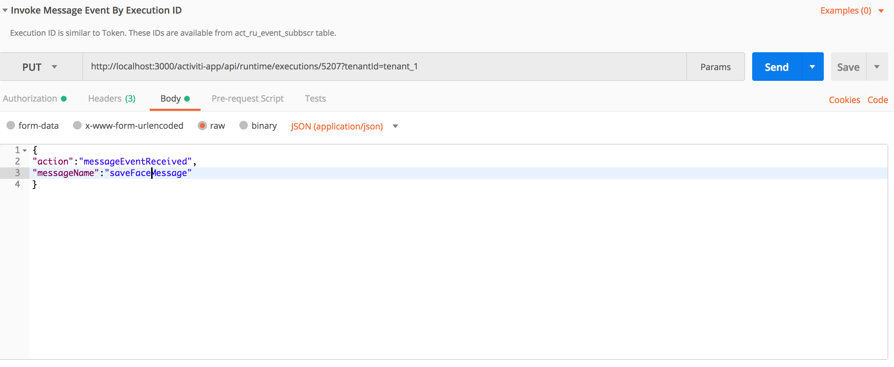

#### The project contains all the components required to trigger a boundary message event using REST calls

### Use-Case / Requirement
A serial approval pipeline process with two-levels. The tasks approved by first-level approver should route to task-list of second-level approver (Manager). The first-level approver should also have the capability to revert/recall the submitted tasks. Thus recalled tasks should be closed/moved out from second-level approver's (Manager) task-list and requeued back to first-level approver's inbox, without any loss of data.


### Prerequisites to run this demo end-2-end

* Alfresco Process Services (powered by Activiti) (Version 1.9 and above) - If you don't have it already, you can download a 30 day trial from [Alfresco Process Services (APS)](https://www.alfresco.com/products/business-process-management/alfresco-activiti).Instructions & help available at [Activiti Docs](http://docs.alfresco.com/activiti/docs/), [Alfresco BPM Community](https://community.alfresco.com/community/bpm)


## Configuration Steps

### Activiti Setup and Process Deployment
1. Import the [Save-Face-BME.zip](Save-Face-BME.zip) app available in this project into Activiti.
2. The process flow.  
3. The process configuration. 
4. The boundary message event. 
5. The message event defenition. 
6. Publish/Deploy the App.

### POSTMAN
1. Use POSTMAN to make REST calls and trigger the Boundary Message Events. 

    TIP: Quickly import REST Calls from [POSTMAN Collection](Postman-Collection-MessageEvents.postman_collection.json).

2. As the first step, REST GET call should be to get the Execution ID of the targeted Boundary Message Event.
```
http://<hostname>:<port>/activiti-app/api/runtime/executions?tenantId=<tenantId>&processInstanceId=<instanceID>
```
The configuration is shown below. 
If necessary, the value of Execution ID can be cross-verified by querying the DB.


3. As the second step, REST PUT call should send trigger for Boundary Message Event.
```
http://<hostname>:<port>/activiti-app/api/runtime/executions/<execution-id-of-boundar-message-event>?tenantId=<tenantId>
```
The header of PUT call is as follows:
```javascript
Authorization = Basic xxxxxxxxxxxxxxx
cache-control = no-cache
content-type = application/json
```
The body of the PUT call is as follows: 
```json
{
"action":"messageEventReceived",
"messageName":"saveFaceMessage"
}
```
The configuration is shown below. 

### Run the DEMO

### References
1. https://www.activiti.org/userguide/index.html#restQueryVariable
2. https://www.activiti.org/userguide/index.html#restExecutionsGet
3. http://localhost:3000/activiti-app/api-explorer.html#/
