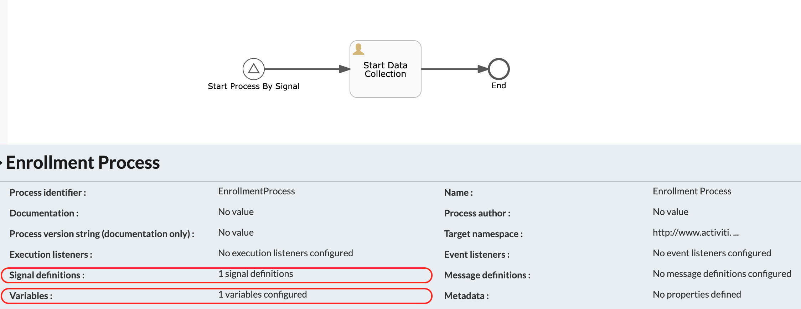
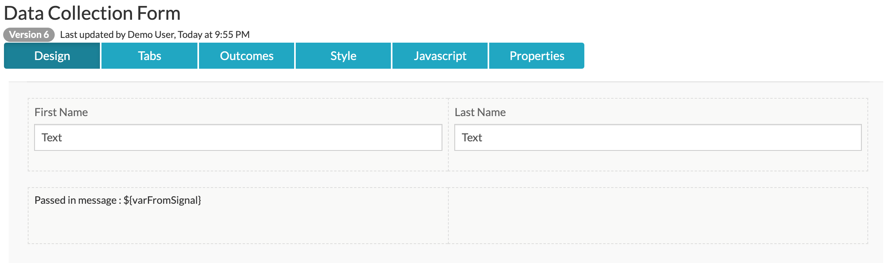

#### The project contains all the components required to launch a process by triggering a Start Message Event using REST calls

### Use-Case / Requirement
A process can have the necessity to launch another process based on a business rule. One of the methods to launch the subsequent process is by using a message start event.

### Prerequisites to run this demo end-2-end

* Alfresco Process Services (powered by Activiti) (Version 1.9 and above) - If you don't have it already, you can download a 30 day trial from [Alfresco Process Services (APS)](https://www.alfresco.com/products/business-process-management/alfresco-activiti).Instructions & help available at [Activiti Docs](http://docs.alfresco.com/activiti/docs/), [Alfresco BPM Community](https://community.alfresco.com/community/bpm)


## Configuration Steps

### Activiti Setup and Process Deployment
1. Setup Alfresco Activiti if you don't have one already. Instructions & help available at [Activiti Docs](http://docs.alfresco.com/activiti/docs/), [Alfresco BPM Community](https://community.alfresco.com/community/bpm)
2. Import the [Launch-process-by-start-message-event.zip](Launch-process-by-start-message-event.zip) app available in this project into Activiti.
3. The process diagram of triggering process 
4. REST Call Configuration in triggering process. 
5. REST Call Request Headers in triggering process. 
```
Header name: Content-Type
Header value: application/json
```
6. REST Call Endpoint in triggering process. 
```
Endpoint:
http://<hostname>:<port>/activiti-app/api/runtime/process-instances?tenantId=<tenantId>

```
7. REST Call Request Mapping in triggering process. 
```
The values are:
message - The name of the message definition you are throwing and catching. You will need to define this in the process that you want to catch.
tenantId - The ID of the tenant in which to throw the message event. Usually, the default tenantId will be "tenant_1"
variables - Any variables you want to pass to catch events. You will need to define these in the catch process.
```
An example is as follows:
```
{
    "message": "myMessage",
    "tenantId": "tenant_1",
    "variables": [
        {
            "name": "varFromMessage",
            "value": "This is from start message event"
        }
    ]
}
```
8. The process diagram of target process. 
9. The start message event. 
10. The message event definition. 
11. The form in target process. 
12. Publish/Deploy the App.

### Run the DEMO

### References
1. https://www.activiti.org/userguide/#_start_a_process_instance
