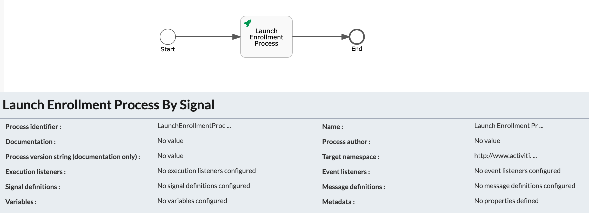
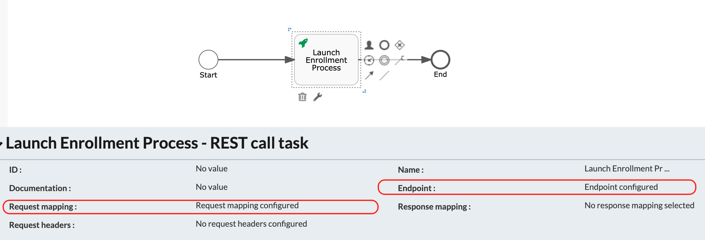
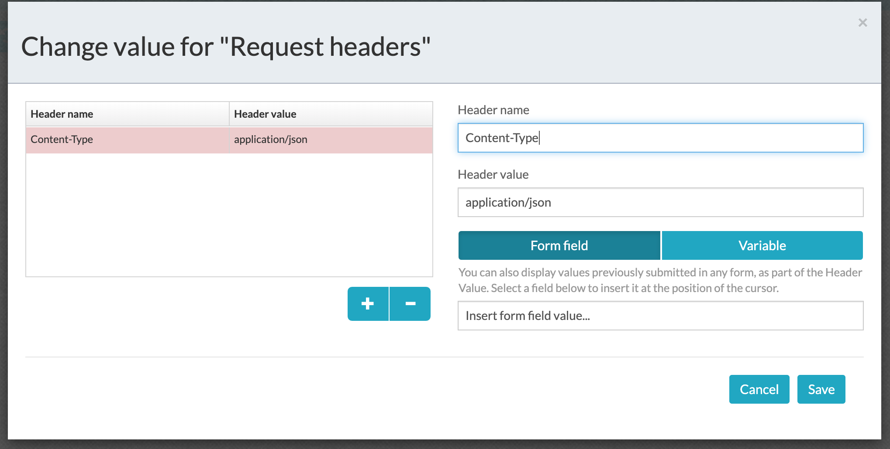
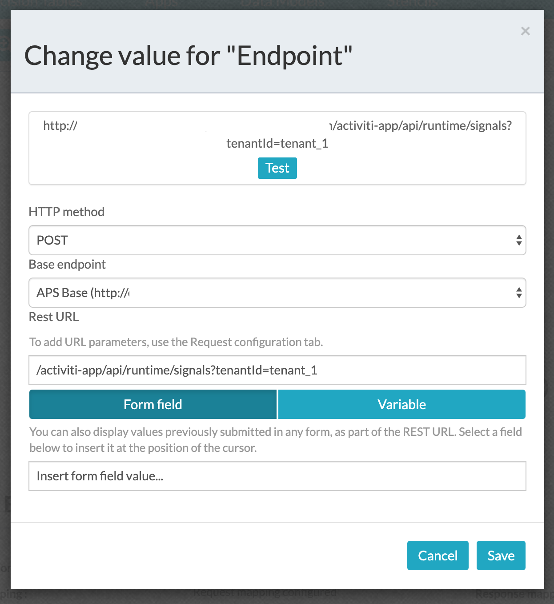
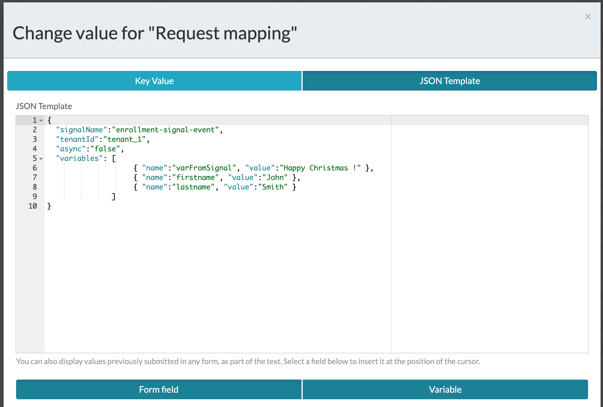
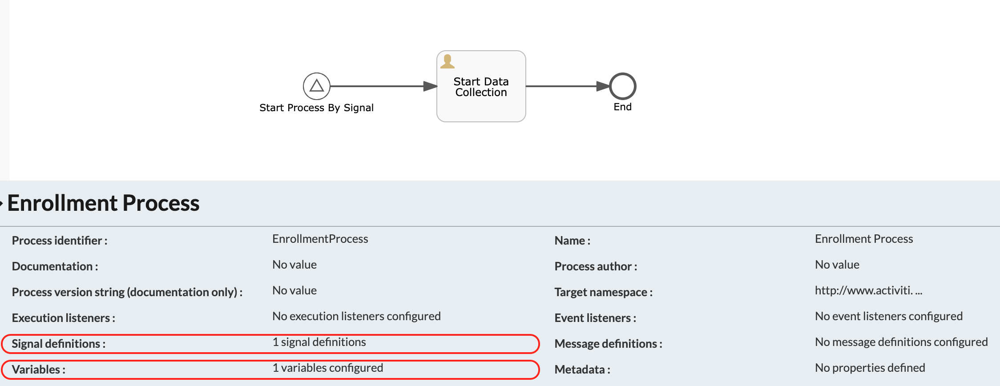
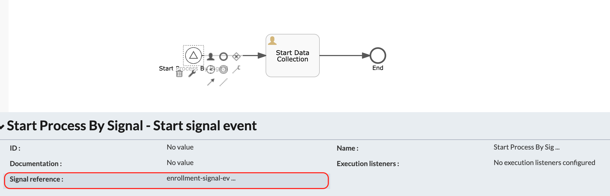
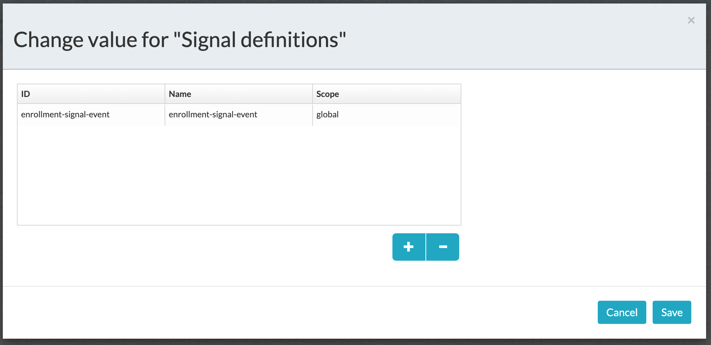
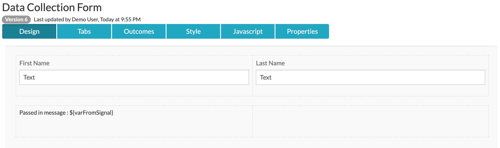

#### The project contains all the components required to launch a process by triggering a start signal event using REST calls

### Use-Case / Requirement
A process can have the necessity to launch another process based on a business rule. One of the methods to launch the subsequent process is by using a signal start event.

### Prerequisites to run this demo end-2-end

* Alfresco Process Services (powered by Activiti) (Version 1.9 and above) - If you don't have it already, you can download a 30 day trial from [Alfresco Process Services (APS)](https://www.alfresco.com/products/business-process-management/alfresco-activiti).Instructions & help available at [Activiti Docs](http://docs.alfresco.com/activiti/docs/), [Alfresco BPM Community](https://community.alfresco.com/community/bpm)


## Configuration Steps

### Activiti Setup and Process Deployment
1. Setup Alfresco Activiti if you don't have one already. Instructions & help available at [Activiti Docs](http://docs.alfresco.com/activiti/docs/), [Alfresco BPM Community](https://community.alfresco.com/community/bpm)
2. Import the [Launch-process-by-start-signal-event.zip](Launch-process-by-start-signal-event.zip) app available in this project into Activiti.
3. The process diagram of triggering process 
4. REST Call Configuration in triggering process. 
5. REST Call Request Headers in triggering process. 
```
Header name: Content-Type
Header value: application/json
```
6. REST Call Endpoint in triggering process. 
```
Endpoint for Instance specific calls
http://<hostname>:<port>/activiti-app/api/runtime/signals?tenantId=<tenantId>&processInstanceId=<instanceID>

Endpoint for Global Calls
http://<hostname>:<port>/activiti-app/api/runtime/signals?tenantId=<tenantId>
```
7. REST Call Request Mapping in triggering process. 
```
The values are:
signalName - The name of the signal you are throwing and catching. You will need to define this in the process that you want to catch the signal.
tenantId - The ID of the tenant in which to throw the signal. In a non-MT environment, the tenantId will be "tenant_1"
async - If you want the throw to be executed asynchronously
variables - Any variables you want to pass to catch events. You will need to define these in the catch process.
```
An example is as follows:
```
{
  "signalName":"enrollment-signal-event",
  "tenantId":"tenant_1",
  "async":"false",
  "variables": [
                    { "name":"varFromSignal", "value":"Happy Christmas !" },
                    { "name":"firstname", "value":"John" },
                    { "name":"lastname", "value":"Smith" }
               ]
}
```
8. The process diagram of target process. 
9. The start signal event. 
10. The signal event definition. 
11. The form in target process. 
12. Publish/Deploy the App.

POSTMAN Collection is available at [Start-Events-APS.postman_collection.json](Start-Events-APS.postman_collection.json)

### Run the DEMO

### References
1. http://docs.alfresco.com/activiti/docs/user-guide/1.5.0/#app-bpmn-start-signal-event
