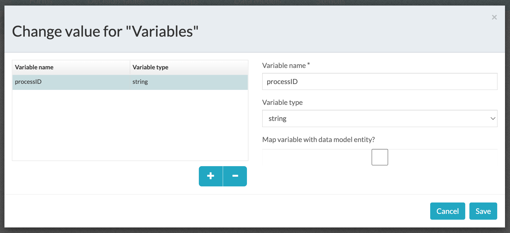

#### The project contains the configuration tips required to get an ACS document and display in APS

### Use-Case / Requirement

The user should able to :

1. Programatically download contents from ACS (using REST API GET call)
2. Open and view those files in APS Forms File Viewer.

### Prerequisites to run this demo end-2-end

* Alfresco Process Services (powered by Activiti) (Version 1.9 and above) - If you don't have it already, you can download a 30 day trial from [Alfresco Process Services (APS)](https://www.alfresco.com/products/business-process-management/alfresco-activiti).Instructions & help available at [Activiti Docs](http://docs.alfresco.com/activiti/docs/), [Alfresco BPM Community](https://community.alfresco.com/community/bpm)

## Configuration Steps

> The whitelisting of beans is a mandatory step for the correct working of beans used in GROOVY script. More details at <https://docs.alfresco.com/process-services/latest/develop/dev-ext/#spring-beans>

### Activiti Setup and Process Deployment

1. Setup Alfresco Activiti if you don't have one already. Instructions & help available at [Activiti Docs](http://docs.alfresco.com/activiti/docs/), [Alfresco BPM Community](https://community.alfresco.com/community/bpm)
2. Import the [Display-ACS-Content-in-APS.zip](assets/Display-ACS-Content-in-APS.zip) app available in this project into APS.
3. The process flow.  
4. Process Variables 
5. Start Form configuration properties 
6. Start Form 
7. Groovy Script to fetch Alfresco Content 
8. Groovy Script

    ``` groovy
    import org.apache.http.client.methods.HttpGet;
    import org.apache.http.client.methods.HttpPost;
    import org.apache.http.impl.client.DefaultHttpClient;
    import org.apache.http.HttpResponse;

    import com.activiti.service.api.UserService;
    import com.activiti.domain.idm.User;
    import com.activiti.domain.runtime.RelatedContent;
    import com.activiti.service.runtime.RelatedContentStreamProvider;
    import com.activiti.service.runtime.RelatedContentService;

    import java.io.InputStream;
    import java.io.OutputStream;

    import org.apache.commons.io.IOUtils;
    import java.nio.charset.StandardCharsets;

    pid = execution.getProcessInstanceId();
    execution.setVariable('processID',pid);

    mimeType = "application/pdf";
    aps_fileName = "myfile.pdf"; 
    aps_docVariableName = "docContents"; 
    User aps_user = userService.findActiveUserByEmail("admin@app.activiti.com");  // This could be any user with the rights to create APS variables.

    docid = "a0e2c807-0701-40d1-b1e3-72e3f7157706"
    apiGetFile = "http://<acs-hostname>/alfresco/api/-default-/public/alfresco/versions/1/nodes/" + docid + "/content?attachment=true"

    HttpGet reqGet = new HttpGet(apiGetFile);
    reqGet.setHeader("Authorization", "Basic ZGVtbzpkZW1v"); 
    DefaultHttpClient clientGet = new DefaultHttpClient();
    HttpResponse responseGet = clientGet.execute(reqGet);

    InputStream inputStreamGet = responseGet.getEntity().getContent();

    RelatedContent newRelatedContentObject = relatedContentService.createRelatedContent(
    aps_user, aps_fileName, null, null,
    null, pid, aps_docVariableName, mimeType, inputStreamGet, 0L);

    // out.println("ACV Response from Get: " + responseGet);
    // inputStreamGet.close();
    // relid = Long.toString(newRelatedContentObject.getId());
    // out.println("newid: " + relid);

    ```

9. Document Uploader Properties.  
10. Document Uploader Visibility.  
11. Display Content Task. 
12. Display Content Form. 
13. Display Content Form Properties. 
14. Publish/Deploy the App.

### Run the DEMO


### References

1. <https://docs.alfresco.com/process-services/latest/develop/dev-ext/#spring-beans>
