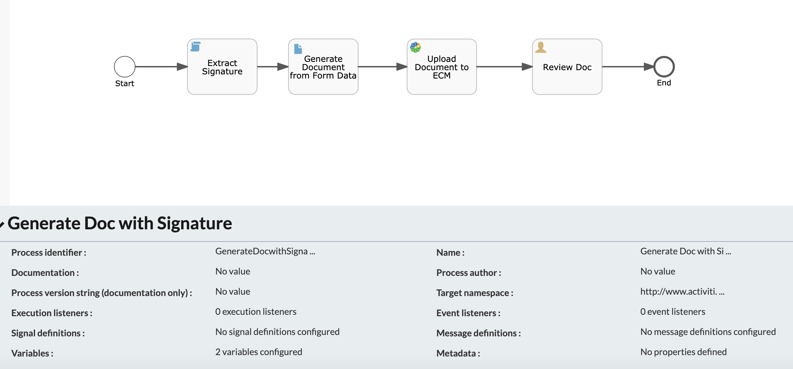
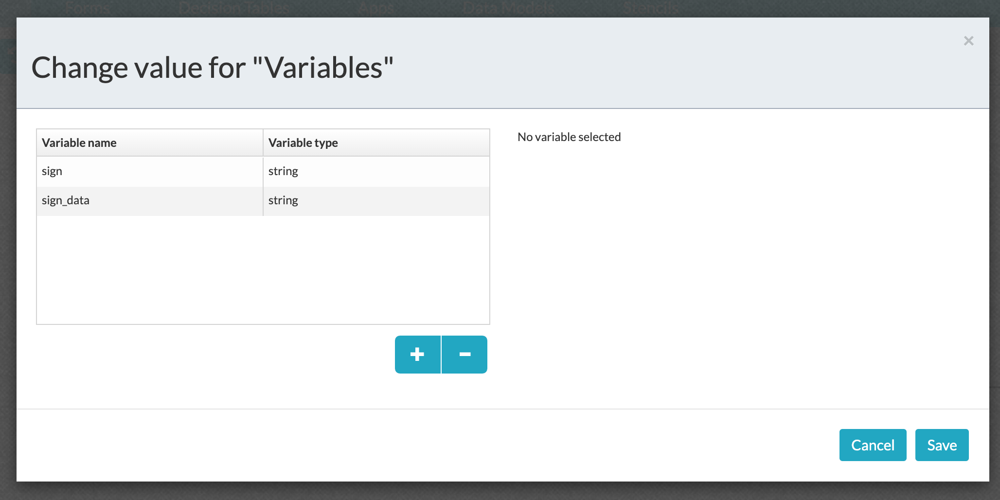
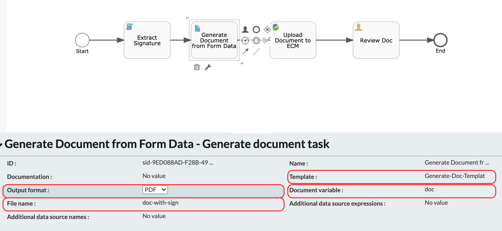
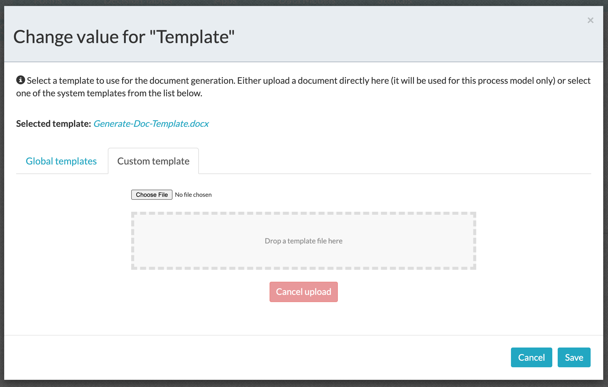
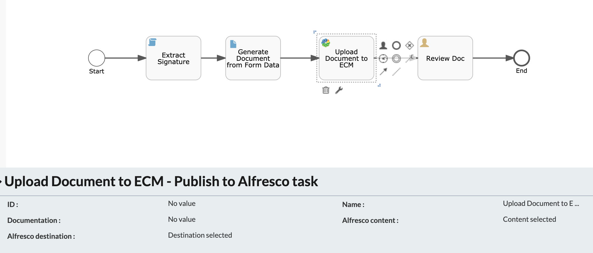
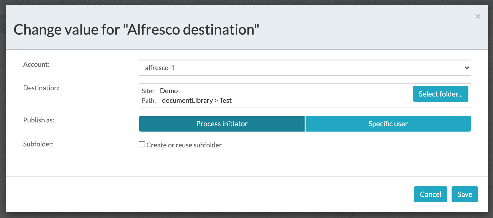
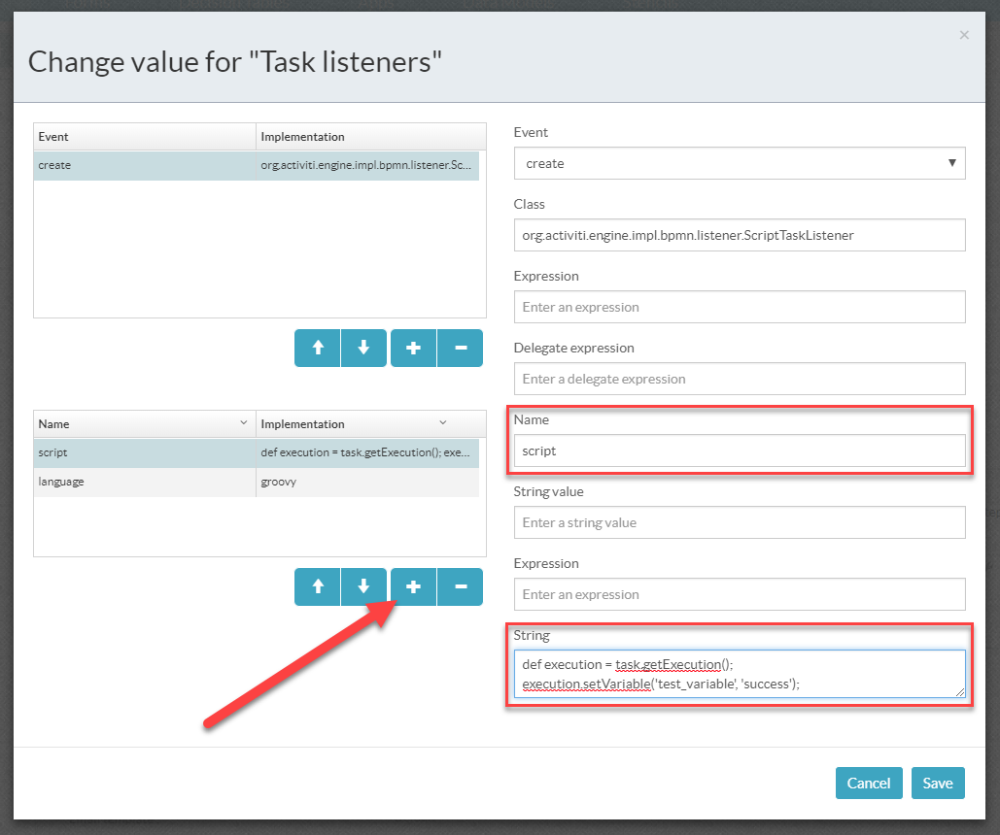

#### The project contains the tips required to generate a document with APS Form values

### Use-Case / Requirement
As part of the process, it is required to capture the APS Form values and generate a document out of a template.

### Prerequisites to run this demo end-2-end

* Alfresco Process Services (powered by Activiti) (Version 1.9 and above) - If you don't have it already, you can download a 30 day trial from [Alfresco Process Services (APS)](https://www.alfresco.com/products/business-process-management/alfresco-activiti).Instructions & help available at [Activiti Docs](http://docs.alfresco.com/activiti/docs/), [Alfresco BPM Community](https://community.alfresco.com/community/bpm)


## Configuration Steps

### Activiti Setup and Process Deployment
1. Setup Alfresco Activiti if you don't have one already. Instructions & help available at [Activiti Docs](http://docs.alfresco.com/activiti/docs/), [Alfresco BPM Community](https://community.alfresco.com/community/bpm)
2. Import the [Generate-Documents.zip](Generate-Documents.zip) app available in this project into Activiti.
3. The process flow.  
4. The process variables configuration. 
5. The Generate Document Task. 
6. The Generate Document Task : Custom Template. 
[A custom template is available here](images/Generate-Doc-Template.docx):
   
7. The Generate Document Task : Global Template. 
8. The Upload to ACS Task configuration. 

9.  Publish/Deploy the App.

### Task Listener Configuration
1. ScriptTaskListener Event Class
```
org.activiti.engine.impl.bpmn.listener.ScriptTaskListener
```
2. language
```
javascript or groovy depending on your script
```

3. script
```
task.execution.setVariable("requestSubmitter", userInfoBean.getFullName(userInfoBean.getCurrentUser().getId())); task.execution.setVariable("submittedTaskName", task.getName());
```
OR as shown below 

### Run the DEMO


### References
1. http://howtobrothers.com/2018/03/03/how-to-set-a-task-listener-on-the-app-designer-visual-editor-in-alfresco-process-services/
