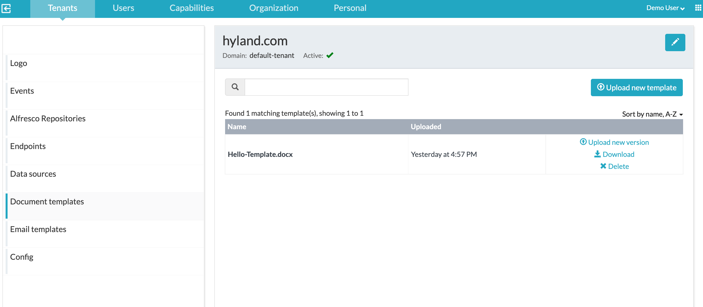
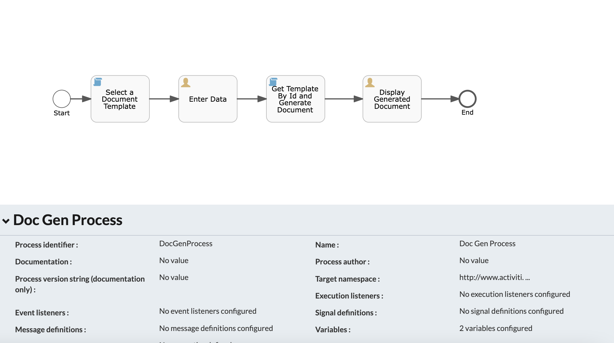
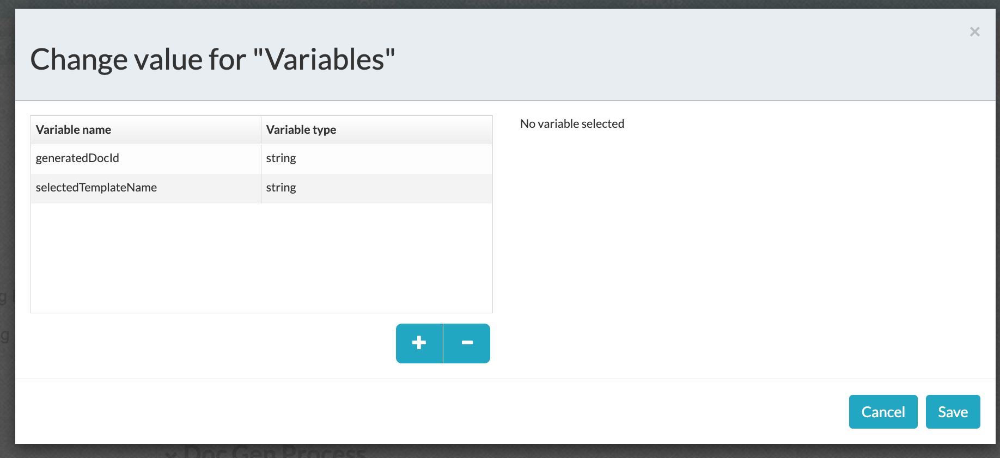
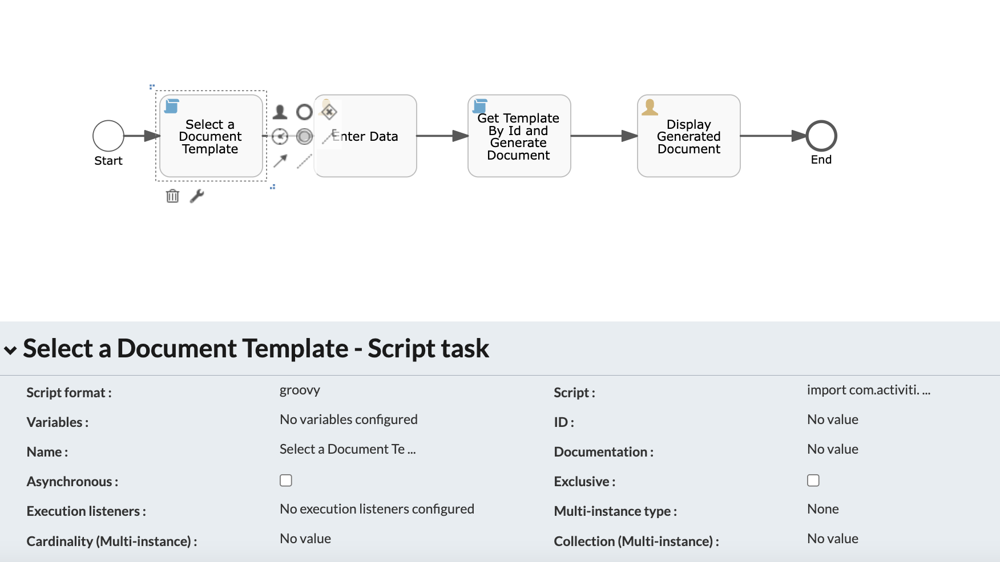
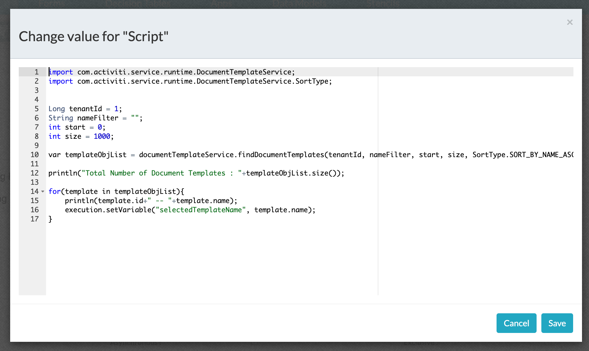
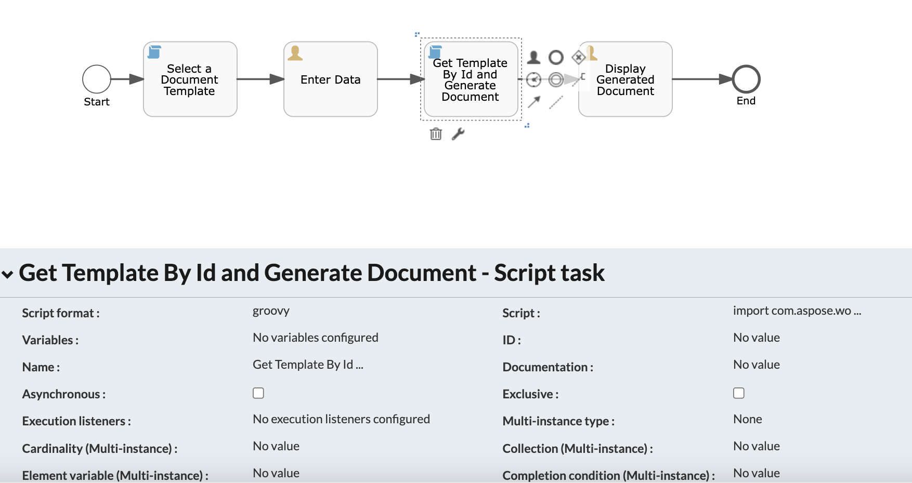
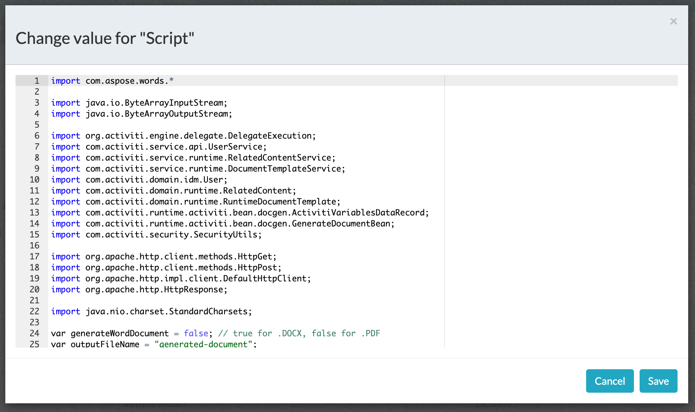
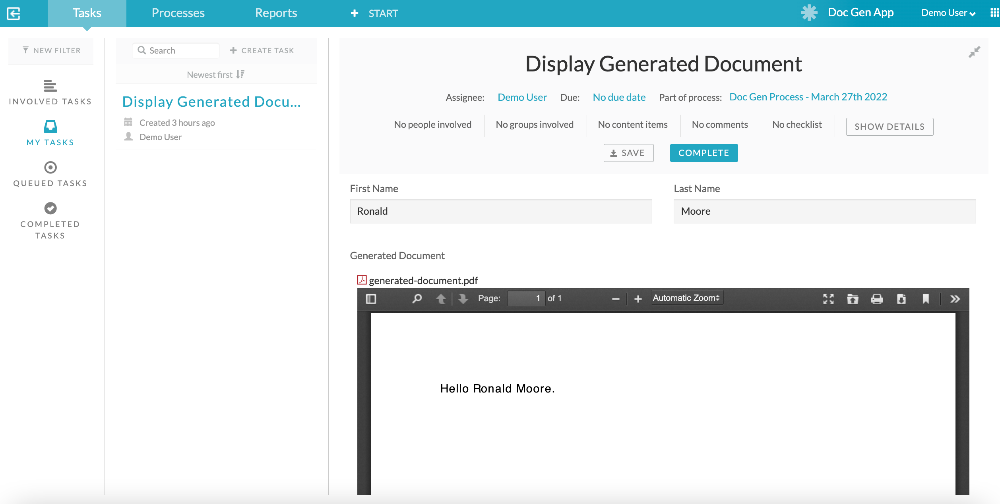

#### The project contains the tips  to generate a document based on the user-selected document template

### Use-Case / Requirement

As part of the process, it is required to generate a document that based on a document template pre-selected by the user.

### Prerequisites to run this demo end-2-end

* Alfresco Process Services (powered by Activiti) (Version 1.9 and above) - If you don't have it already, you can download a 30 day trial from [Alfresco Process Services (APS)](https://www.alfresco.com/products/business-process-management/alfresco-activiti).Instructions & help available at [Activiti Docs](http://docs.alfresco.com/activiti/docs/), [Alfresco BPM Community](https://community.alfresco.com/community/bpm)

* Upload the [Document Template](assets/Hello-Template.docx) to APS. 

### Activiti Setup and Process Deployment

1. Setup Alfresco Activiti if you don't have one already. Instructions & help available at [Activiti Docs](http://docs.alfresco.com/activiti/docs/), [Alfresco BPM Community](https://community.alfresco.com/community/bpm)

2. Import the [Doc-Gen-App.zip](Doc-Gen-App.zip) app available in this project into Activiti.

3. The process flow. 

4. Process Variables. 

5. Grrovy Script to list all document templates.



   <details>
   <summary>Expand this section for the javascript.</summary>

   ``` javascript
      import com.activiti.service.runtime.DocumentTemplateService;
      import com.activiti.service.runtime.DocumentTemplateService.SortType;

      Long tenantId = 1;
      String nameFilter = "";
      int start = 0;
      int size = 1000;

      var templateObjList = documentTemplateService.findDocumentTemplates(tenantId, nameFilter, start, size, SortType.SORT_BY_NAME_ASC);

      println("Total Number of Document Templates : "+templateObjList.size());

      for(template in templateObjList){
         println(template.id+" -- "+template.name);
         execution.setVariable("selectedTemplateName", template.name);
      }

   ```

   </details>
   <br/>

6. Groovy Script to generate document using selected template.



   <details>
      <summary>Expand this section for the javascript.</summary>

      ``` javascript
      import com.aspose.words.*;
   import java.io.ByteArrayInputStream;
   import java.io.ByteArrayOutputStream;

   import org.activiti.engine.delegate.DelegateExecution;
   import com.activiti.service.api.UserService;
   import com.activiti.service.runtime.RelatedContentService;
   import com.activiti.service.runtime.DocumentTemplateService;
   import com.activiti.domain.idm.User;
   import com.activiti.domain.runtime.RelatedContent;
   import com.activiti.domain.runtime.RuntimeDocumentTemplate;
   import com.activiti.runtime.activiti.bean.docgen.ActivitiVariablesDataRecord;
   import com.activiti.runtime.activiti.bean.docgen.GenerateDocumentBean;
   import com.activiti.security.SecurityUtils;

   import org.apache.http.client.methods.HttpGet;
   import org.apache.http.client.methods.HttpPost;
   import org.apache.http.impl.client.DefaultHttpClient;
   import org.apache.http.HttpResponse;

   import java.nio.charset.StandardCharsets;

   var generateWordDocument = false; // true for .DOCX, false for .PDF
   var outputFileName = "generated-document";
   var variableName = "generateddocumentvar";

   // var templateName = "Hello-Template.docx"; //This has to be changed to match your template-name
   var templateName = execution.getVariable("selectedTemplateName");
   var tenantId = 1; //This has to be changed to match your tenant-id

   var templateObj = documentTemplateService.findDocumentTemplate(tenantId, templateName);
   var templateId = templateObj.id;

   // println ("templateObj ID  ---------------->"+templateId);
   // println ("templateObj Name  ---------------->"+templateObj.name);


   User user = userService.findActiveUserByEmail("demo@example.com");
   // User user = SecurityUtils.getCurrentUserObject();
   println("user.id --> "+user.id);

   RuntimeDocumentTemplate runtimeDocumentTemplate = runtimeDocumentTemplateService.createRuntimeDocumentTemplate(templateId, user, execution.getProcessInstanceId());
   runtimeDocumentTemplate = runtimeDocumentTemplateService.save(runtimeDocumentTemplate);

   println ("runtimeDocumentTemplate ID  ---------------->"+runtimeDocumentTemplate.id);
   println ("runtimeDocumentTemplate Name  ---------------->"+runtimeDocumentTemplate.name);
   println ("*** runtimeDocumentTemplate ID  ---------------->"+ runtimeDocumentTemplateService.findById(runtimeDocumentTemplate.id).id);

   ActivitiVariablesDataRecord variablesDataRecord = new ActivitiVariablesDataRecord(execution, runtimeDocumentTemplate, null, null);

   Document doc = createDocument(variablesDataRecord, runtimeDocumentTemplateService.getContent(runtimeDocumentTemplate));

   File tempFile = File.createTempFile("activiti-generated-document", generateWordDocument ? ".docx" : ".pdf");

   FileOutputStream outputStream = new FileOutputStream(tempFile);
   doc.save(outputStream, generateWordDocument ? SaveFormat.DOCX : SaveFormat.PDF);
   outputStream.flush();
   outputStream.close();
         
   // Store related content
   RelatedContent relatedContent = null;
   if (generateWordDocument) {
      relatedContent = storeAsRelatedContent(execution, outputFileName + ".docx", "application/vnd.openxmlformats-officedocument.wordprocessingml.document", variableName, new FileInputStream(tempFile));
   } else {
      relatedContent = storeAsRelatedContent(execution, outputFileName + ".pdf", "application/pdf", variableName, new FileInputStream(tempFile));
   }

   // Store execution variable
   if (relatedContent != null) {
      execution.setVariable("generatedDocId", relatedContent.getId());
   }

   // delete temp file
   tempFile.delete();


   Document createDocument(ActivitiVariablesDataRecord variablesDataRecord, InputStream inputStream) throws Exception {
   // Open an template document.
   Document doc = new Document(inputStream);
   doc.getMailMerge().setUseNonMergeFields(true);

   ReportingEngine.setUseReflectionOptimization(false);
   ReportingEngine engine = new ReportingEngine();
   engine.buildReport(doc, variablesDataRecord);
   
   return doc;
   }


   RelatedContent storeAsRelatedContent(DelegateExecution execution, String outputFileName, String mimeType, String fieldName, InputStream inputStream) {

      final RelatedContent relatedContent = relatedContentService.createRelatedContent(SecurityUtils.getCurrentUserObject(), 
         outputFileName, null, null, null, execution.getProcessInstanceId(), fieldName, mimeType, inputStream, null);

      if (inputStream != null) {
         try {
               inputStream.close();
         } catch (IOException e) { }
      }

      return relatedContent;
   }

      ```

      </details>
      <br/>

7. Publish/Deploy the App.

### Run the DEMO



### References

1. <https://github.com/Alfresco/activiti-bpm-suite/blob/master/activiti-bpm-suite/activiti-app-logic/src/main/java/com/activiti/runtime/activiti/bean/docgen/GenerateDocumentBean.java>
2. <https://github.com/Alfresco/activiti-bpm-suite/blob/master/activiti-bpm-suite/activiti-app-logic/src/main/java/com/activiti/service/runtime/DocumentTemplateService.java>
3. <https://github.com/Alfresco/activiti-bpm-suite/blob/master/activiti-bpm-suite/activiti-app-logic/src/main/java/com/activiti/service/runtime/RuntimeDocumentTemplateService.java>
