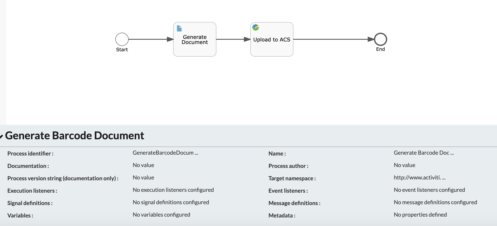
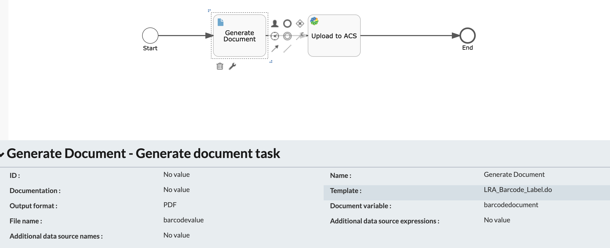
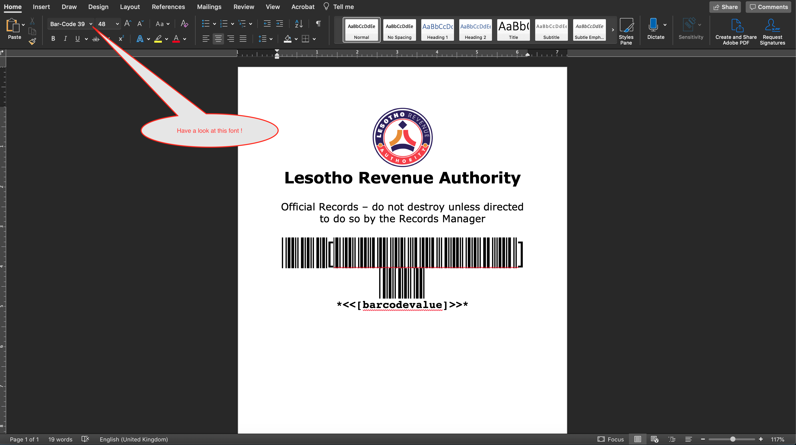
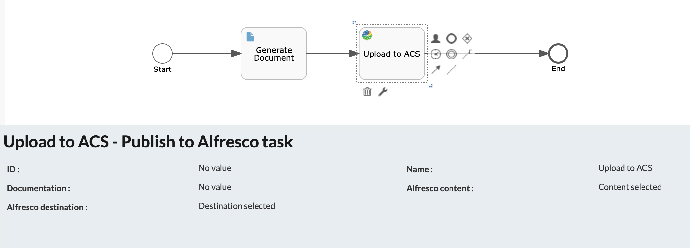
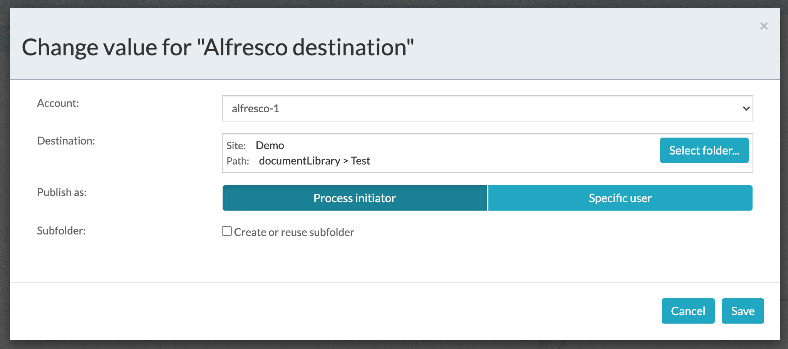
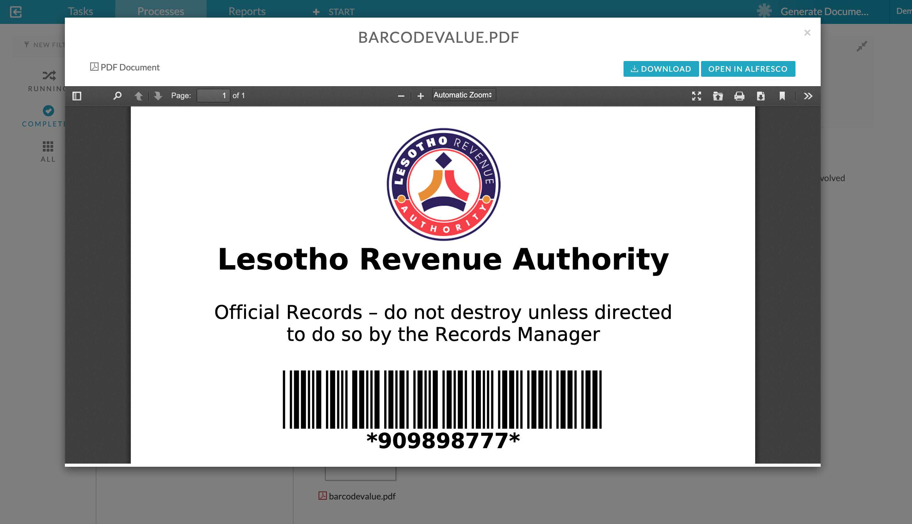

#### The project contains the tips  to generate a document with barcode based on a business value.

### Use-Case / Requirement
As part of the process, it is required to generate a document that has a barcode which is mapped to a process value. (eg: Account Number)

### Prerequisites to run this demo end-2-end

* Alfresco Process Services (powered by Activiti) (Version 1.9 and above) - If you don't have it already, you can download a 30 day trial from [Alfresco Process Services (APS)](https://www.alfresco.com/products/business-process-management/alfresco-activiti).Instructions & help available at [Activiti Docs](http://docs.alfresco.com/activiti/docs/), [Alfresco BPM Community](https://community.alfresco.com/community/bpm)

## Configuration Steps
1. Install the Bar Code Font in your server.
   [A few barcode fonts are available here](assets/fonts).
   
2. For Unix, 
   - Download these fonts to `/usr/local/share/fonts`. 
      - Note: If `fonts` folder doesnt exist, you've to create one `mkdir fonts`.
   - Run `yum install fontconfig` 
   - Run `fc-cache -f -v`
     - Note: Detailed step-by-step instructions are available [here](https://medium.com/source-words/how-to-manually-install-update-and-uninstall-fonts-on-linux-a8d09a3853b0).
   
3. For Windows, use the font installer.

### Activiti Setup and Process Deployment
1. Setup Alfresco Activiti if you don't have one already. Instructions & help available at [Activiti Docs](http://docs.alfresco.com/activiti/docs/), [Alfresco BPM Community](https://community.alfresco.com/community/bpm)
   
2. Import the [Generate-Documents.zip](Generate-Documents.zip) app available in this project into Activiti.
   
3. The process flow.  
   
4. The Generate Document Task. 
   
5. The Generate Document Task : Template with Barcode Placeholder. 

   
[A template is available here](assets/Generate-Doc-Template.docx):

6. The Upload to ACS Task configuration. 
   
   

   

7.  Publish/Deploy the App.

### Run the DEMO
1. A screenshot of generated document.
   

### References
1. https://docs.alfresco.com/process-services1.7/topics/document_templates.html
2. https://medium.com/source-words/how-to-manually-install-update-and-uninstall-fonts-on-linux-a8d09a3853b0
3. https://command-not-found.com/fc-cache
4. https://www.unixtutorial.org/how-to-install-ttf-fonts-in-linux/