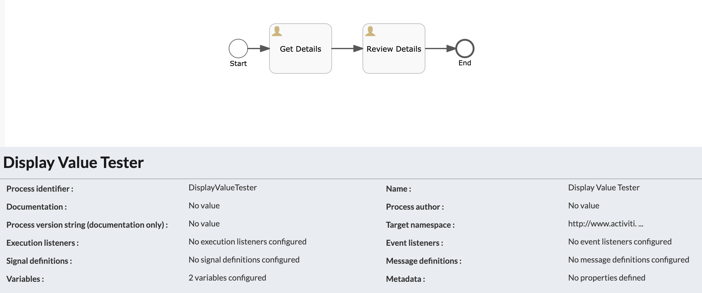

#### The project contains the tips required to get a task name and name of user who completed that task

### Use-Case / Requirement
Upon a task completion, it is required to capture the details of the task. Mainly:
1. Task Name
2. Name of user who completes the task
These details can be useful for routing the workflow or to be maintained as part of the process data.

Here is a tip to quickly capture these details as part of ScriptTaskListener


### Prerequisites to run this demo end-2-end

* Alfresco Process Services (powered by Activiti) (Version 1.9 and above) - If you don't have it already, you can download a 30 day trial from [Alfresco Process Services (APS)](https://www.alfresco.com/products/business-process-management/alfresco-activiti).Instructions & help available at [Activiti Docs](http://docs.alfresco.com/activiti/docs/), [Alfresco BPM Community](https://community.alfresco.com/community/bpm)


## Configuration Steps

### Activiti Setup and Process Deployment
1. Setup Alfresco Activiti if you don't have one already. Instructions & help available at [Activiti Docs](http://docs.alfresco.com/activiti/docs/), [Alfresco BPM Community](https://community.alfresco.com/community/bpm)
2. Import the [Task-Data.zip](Task-Data.zip) app available in this project into Activiti.
3. The process flow.  
4. The process variables configuration. 
5. The task listener. 
6. The signal event definition. 
7. Publish/Deploy the App.

### POSTMAN
1. Use POSTMAN to make REST calls and trigger the Boundary Signal Events.

    TIP: Quickly import REST Calls from [POSTMAN Collection](Postman-Collection-SignalEvents.postman_collection.json).

2. As the first step, REST GET call should be to get the Execution ID of the targeted Boundary Signal Event.
```
http://<hostname>:<port>/activiti-app/api/runtime/executions?tenantId=<tenantId>&processInstanceId=<instanceID>
```
The configuration is shown below. 
If necessary, the value of Execution ID can be cross-verified by querying the DB.


3. As the second step, REST PUT call should send trigger for Boundary Signal Event.
```
http://<hostname>:<port>/activiti-app/api/runtime/executions/<execution-id-of-boundary-signal-event>?tenantId=<tenantId>
```
The header of PUT call is as follows:
```javascript
Authorization = Basic xxxxxxxxxxxxxxx
cache-control = no-cache
content-type = application/json
```
The body of the PUT call is as follows: 
```json
{
"action":"signalEventReceived",
"signalName":"saveFaceSignal"
}
```
The configuration is shown below. 

### Run the DEMO

### References
1. https://www.activiti.org/userguide/index.html#restQueryVariable
2. https://www.activiti.org/userguide/index.html#restExecutionsGet
3. http://localhost:3000/activiti-app/api-explorer.html#/

