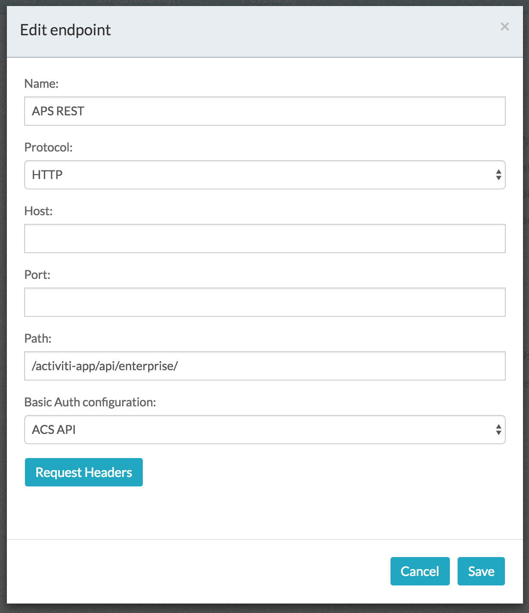
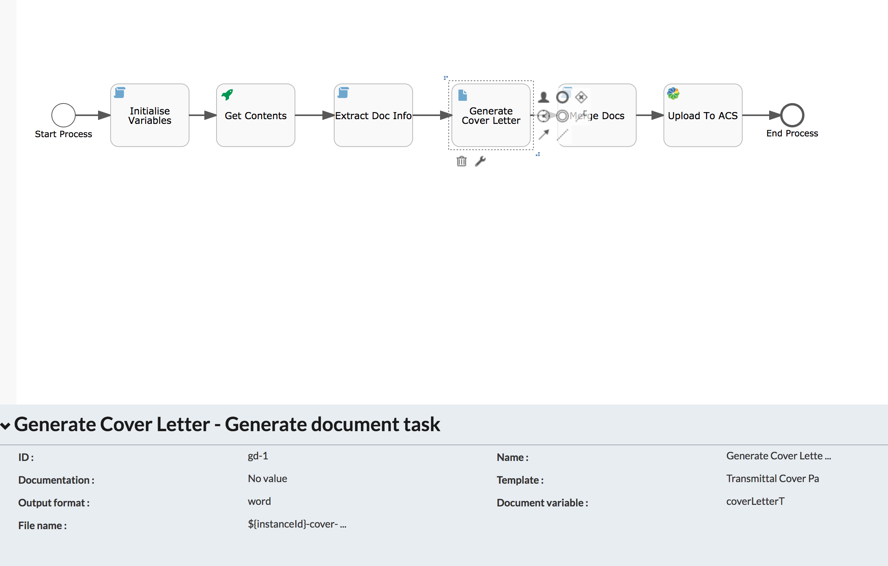
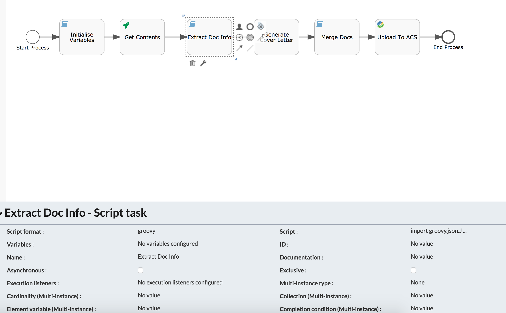

#### This project contains all the components required to merge the attached doc files (.doc/.docx) in a process

### Use-Case / Requirement
The workflow should create a cover page, with the names from the attached .doc/.docx documents.
Store the cover page in Alfresco Content Repo.
Generate another document by combining the cover page and the merged documents.

### Prerequisites to run this demo end-2-end

* Alfresco Process Services (powered by Activiti) (Version 1.9 and above) - If you don't have it already, you can download a 30 day trial from [Alfresco Process Services (APS)](https://www.alfresco.com/products/business-process-management/alfresco-activiti).Instructions & help available at [Activiti Docs](http://docs.alfresco.com/activiti/docs/), [Alfresco BPM Community](https://community.alfresco.com/community/bpm)


## Configuration Steps

### Activiti Setup and Process Deployment
1. Setup Alfresco Activiti if you don't have one already. Instructions & help available at [Activiti Docs](http://docs.alfresco.com/activiti/docs/), [Alfresco BPM Community](https://community.alfresco.com/community/bpm)
2. Import the [Merge-Documents.zip](Merge-Documents.zip) app available in this project into Activiti.
3. The process flow.  
4. The REST API configuration. 
5. The REST Call's Endpoint configuration.  
6. Configure Endpoint in Tentant  
7. The Generate Document configuration. 
8. Javascript code to extract info of attached documents 
    ```javascript
    import groovy.json.JsonSlurper;

    def jsonSlurper = new JsonSlurper();
    def attachedFileList = jsonSlurper.parseText(execution.getVariable('attachedFiles'));
    def attachedFileNames = attachedFileList.findAll().collect{it.name};
    execution.setVariable('attachedFileNames', attachedFileNames);
    ```
    
9. The javascript code to merge document.
    ```javascript
    java.lang.System.out.println("***  Started - Merge document *** ");
    documentMergeBean.mergeDocuments('coverLetterDoc;file1;file2', 'coverLetterDoc', execution);
    java.lang.System.out.println("***  Finished - Merge document *** ");
    ```

    

10. Publish to Alfresco configuration. 
11. Publish/Deploy the App.


### Run the DEMO

### References
1. http://docs.alfresco.com/process-services1.6/topics/document_merge_bean_documentmergebean.html
2. https://docs.alfresco.com/activiti/docs/dev-guide/1.4.0/#_document_merge_bean_documentmergebean
3. http://docs.alfresco.com/process-services1.6/topics/document_templates.html
4. https://docs.alfresco.com/activiti/docs/dev-guide/1.5.0/#_document_templates
