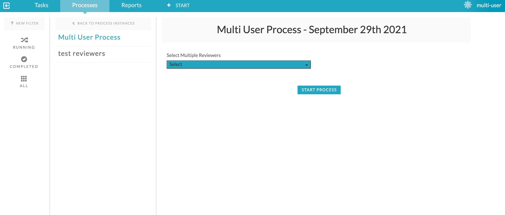

#### The project contains all the components required to create multi-instance tasks and assign to selected users from a multi-list.

### Use-Case / Requirement
Build a process :
1. User should be able to select multiple users from a multi-select dropdown that lists all users in APS.
2. A multi-instance task (parallel) should be created.
3. These multiple instances of same task should be assigned to all selected users.


### Prerequisites to run this demo end-2-end

* Alfresco Process Services (powered by Activiti) (Version 1.9 and above) - If you don't have it already, you can download a 30 day trial from [Alfresco Process Services (APS)](https://www.alfresco.com/products/business-process-management/alfresco-activiti).Instructions & help available at [Activiti Docs](http://docs.alfresco.com/activiti/docs/), [Alfresco BPM Community](https://community.alfresco.com/community/bpm)


## Configuration Steps

### Activiti Setup and Process Deployment
1. Import the [multi-user.zip](assets/multi-user.zip) app available in this project into APS.
2. The process flow.  
3. The Javascript configuration.
   ``` javascript
    var users = execution.getVariable('selectmultiplereviewers');
   print("users:" + users);

   var userObjects = JSON.parse(users);
   print("userObjects:" + userObjects);

   var userIds = new java.util.ArrayList();
   for each (var user in userObjects) {
      print("user email: " + user.email + " -- user id: " + user.id);
      userIds.add(user.id);
   }

   print(">> userIds: " + userIds);

   execution.setVariable("collection",userIds);
    ```

4. Configure `Multi Instance Task` Assignment Property.

   

5. Configure `User Task` Assignment Property.
   

6. Publish/Deploy the App.

### Run the DEMO

1. Login to APS. Select the Process App. Create 'Multi User' Process.

   

2. Select users.

   
   


3. Users are now selected.

   

4. Submit and confirm that `Multi Instance Task` is now created for the selected members.

   


   ## References
   1. https://docs.alfresco.com/process-services/latest/using/process/bpmn/#user-task
   2. https://docs.alfresco.com/process-services/latest/using/process/bpmn/#structural-components

   ## Did this help you ?
   [Buy me a coffee, if you find this helpful!](https://www.buymeacoffee.com/sherrymathews) 😉 ☕ 🍻 🎉
   [<br/>](https://www.buymeacoffee.com/sherrymathews)
