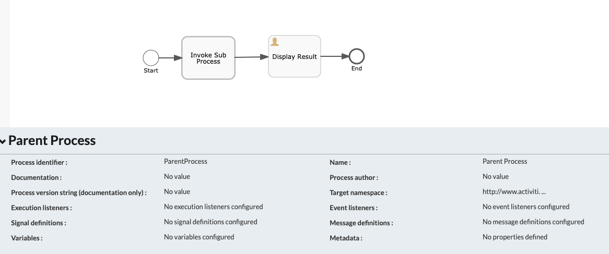
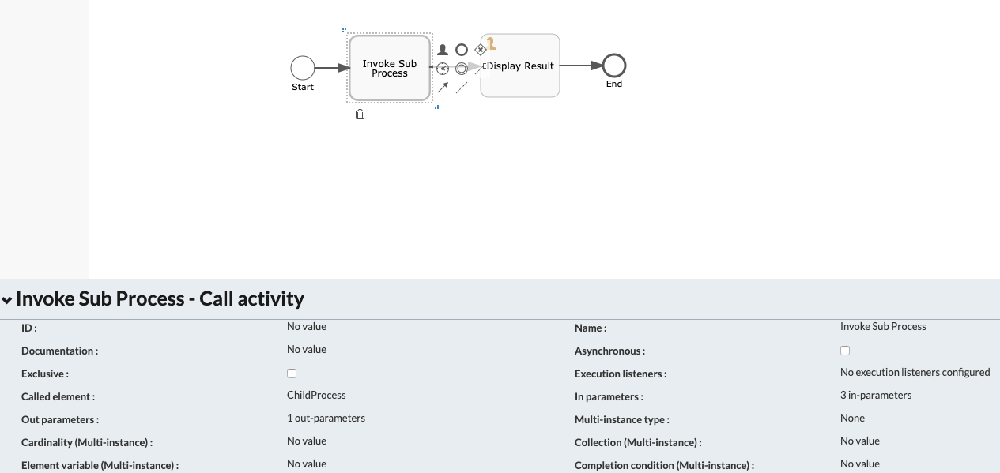
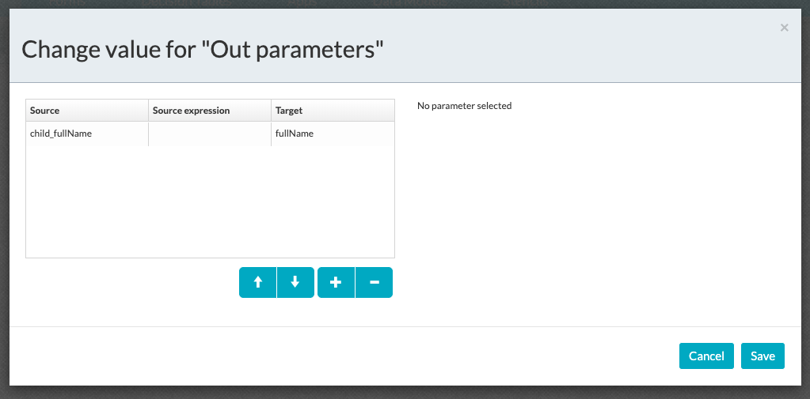
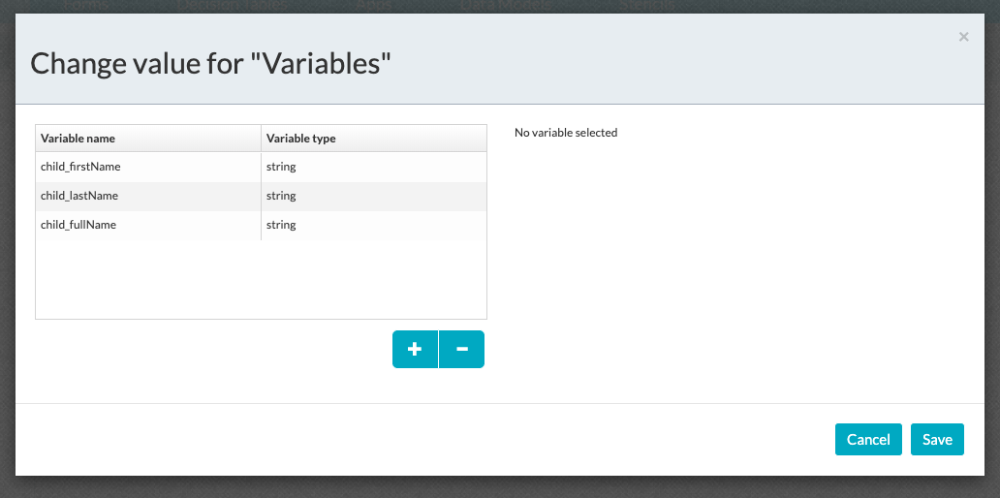
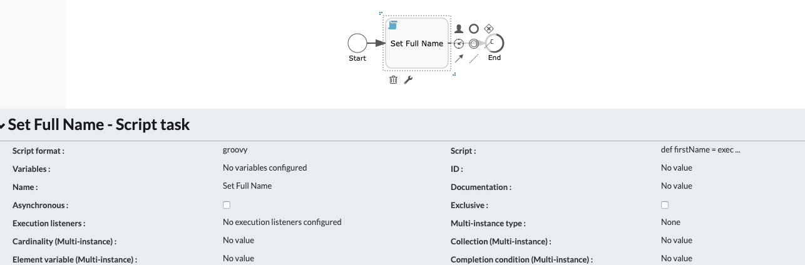

#### The project contains the configuration tips required to pass the variables between parent and sub process in APS

### Use-Case / Requirement
A child/sub-process has to be invoked from a parent process and parameters need to be passed-in. The child/dub-process will perform a script action and return the result back to parent process.

### Prerequisites to run this demo end-2-end

* Alfresco Process Services (powered by Activiti) (Version 1.9 and above) - If you don't have it already, you can download a 30 day trial from [Alfresco Process Services (APS)](https://www.alfresco.com/products/business-process-management/alfresco-activiti).Instructions & help available at [Activiti Docs](http://docs.alfresco.com/activiti/docs/), [Alfresco BPM Community](https://community.alfresco.com/community/bpm)


## Configuration Steps

### Activiti Setup and Process Deployment
1. Setup Alfresco Activiti if you don't have one already. Instructions & help available at [Activiti Docs](http://docs.alfresco.com/activiti/docs/), [Alfresco BPM Community](https://community.alfresco.com/community/bpm)
2. Import the [Parent-Sub-Process-Communication.zip](Parent-Sub-Process-Communication.zip) app available in this project into Activiti.
3. The parent process flow.  
4. Parent Process - Call Activity configuration 
5. Parent Process - Call Activity : In-Parameters 
6. Parent Process - Call Activity : Out-Parameters 
7. The Child/sub-process flow.  
8. Sub-Process : The process variables configuration. 
9. Sub-Process : Script task 
10. Sub-Process : Actual Script
```
def firstName = execution.getVariable("child_firstName");
def lastName = execution.getVariable("child_lastName");
execution.setVariable("child_fullName", firstName + " " + lastName);
```
11. Publish/Deploy the App.


### Run the DEMO


### References
1. http://docs.alfresco.com/activiti/docs/user-guide/1.5.0/#app-bpmn-call-activity
2. https://docs.alfresco.com/process-services1.7/topics/sub_process.html
3. https://docs.alfresco.com/process-services1.7/topics/call_activity.html
