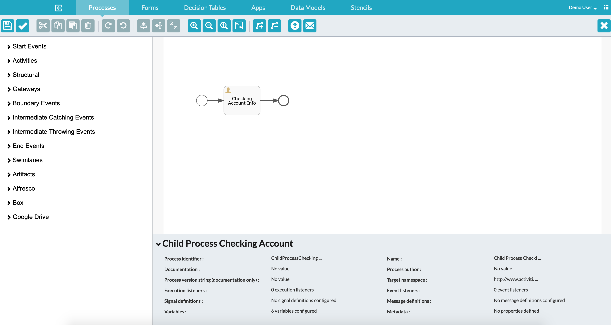

#### The project contains all the components required to copy attachments from child to parent process using Call Activity

### Use-Case / Requirement
Build a process using Call Activity to copy attachments that are uploaded in a child process to its parent process.


### Prerequisites to run this demo end-2-end

* Alfresco Process Services (powered by Activiti) (Version 1.9 and above) - If you don't have it already, you can download a 30 day trial from [Alfresco Process Services (APS)](https://www.alfresco.com/products/business-process-management/alfresco-activiti).Instructions & help available at [Activiti Docs](http://docs.alfresco.com/activiti/docs/), [Alfresco BPM Community](https://community.alfresco.com/community/bpm)


## Configuration Steps

### Activiti Setup and Process Deployment
1. Import the [Call-Activity-Tester.zip](Call-Activity-Tester.zip) app available in this project into Activiti.
2. Process Flow.  
3. Call Activity Configuration.     
4. Task Listener Configuration in Task. 
5. Source Code. [Source-Code](activiti-copy-attachments-java-code.zip)
6. The JAR File. [Copy-attachments.jar](activiti-copy-attachments-1.0.0-SNAPSHOT.jar)
7. Copy the jar file to tomcat-lib location. [eg: /usr/local/tomcat/webapps/activiti-app/WEB-INF/lib/]
8. Publish/Deploy the APS App.
   
### Task Listener Code Script
   ```java
    /**
    * This task listener copies the "supportingfiles" field's attachments in subprocess/child
    * process instance to a new attachment field "supportingfiles" in the
    * parent task.
    */

    package com.activiti.extension.bean;

    import java.util.ArrayList;
    import java.util.List;
    import org.activiti.engine.delegate.DelegateTask;
    import org.activiti.engine.delegate.TaskListener;
    import org.slf4j.Logger;
    import org.slf4j.LoggerFactory;
    import org.springframework.beans.factory.annotation.Autowired;
    import org.springframework.data.domain.Page;
    import org.springframework.stereotype.Component;

    import org.activiti.engine.delegate.Expression;
    import com.activiti.domain.runtime.RelatedContent;
    import com.activiti.repository.runtime.RelatedContentRepository;
    import com.activiti.service.api.UserService;
    import com.activiti.service.runtime.RelatedContentService;

    import java.io.File;
    import java.io.FileInputStream;
    import java.io.FileNotFoundException;
    import org.activiti.engine.delegate.DelegateExecution;

    @Component("copyAttachmentFromChildToParentTaskListener")
    public class CopyAttachmentFromChildToParentTaskListener implements TaskListener {

        
        private static final long serialVersionUID = 1L;
        
        private Expression sourceField;
        private Expression targetField;

        private static final Logger log = LoggerFactory.getLogger(CopyAttachmentFromChildToParentTaskListener.class);

        @Autowired
        private UserService userService;

        @Autowired
        private RelatedContentService relatedContentService;

        @Autowired
        private RelatedContentRepository relatedContentRepository;

        @Override
        public void notify(DelegateTask delegateTask) {
            List<RelatedContent> relatedContent = new ArrayList<RelatedContent>();
            Page<RelatedContent> page = null;
            DelegateExecution execution = delegateTask.getExecution();

            String parentProcessInstanceID  = (String)delegateTask.getExecution().getVariable("superProcessInstanceId");
            String childProcessInstanceID  = (String)delegateTask.getProcessInstanceId();
            
            String sourceFieldName = ((String)(sourceField).getValue(execution)).toLowerCase();
            String targetFieldName = ((String)(targetField).getValue(execution)).toLowerCase();

            System.out.println("*** Parent Process Instance ID ***"+parentProcessInstanceID);
            System.out.println("*** Child Process Instance ID ***"+childProcessInstanceID);
            
            System.out.println("*** Source Field ***"+sourceFieldName);
            System.out.println("*** Target Field ***"+targetFieldName);
            
            
            while ((page == null) || (page.hasNext())) {
                page = relatedContentRepository.findAllByProcessInstanceIdAndField((String) delegateTask.getProcessInstanceId(), sourceFieldName, null);
                relatedContent.addAll(page.getContent());
            }
            for (RelatedContent rc : relatedContent) {
                // Create a new related content object in the Parent Process
                RelatedContent newRelatedContentObject = relatedContentService.createRelatedContent(
                        userService.getUser(new Long(delegateTask.getAssignee())), rc.getName(), rc.getSource(),
                        rc.getSourceId(), delegateTask.getId(), parentProcessInstanceID, targetFieldName,
                        rc.getMimeType(), null, 0L);
                
                // Now copy all the existing values from original attachment to the newly created related content
                newRelatedContentObject.setContentStoreId(rc.getContentStoreId());
                newRelatedContentObject.setContentAvailable(rc.isContentAvailable());
                newRelatedContentObject.setContentSize(rc.getContentSize());
                newRelatedContentObject.setRelatedContent(rc.isRelatedContent());
                newRelatedContentObject.setField(targetFieldName);
                
                // Save
                relatedContentRepository.saveAndFlush(newRelatedContentObject);
            }
        }

    }
```


### Run the DEMO

### References
1. https://github.com/cijujoseph/activiti-examples/tree/master/activiti-copy-attachments-from-parent-process
