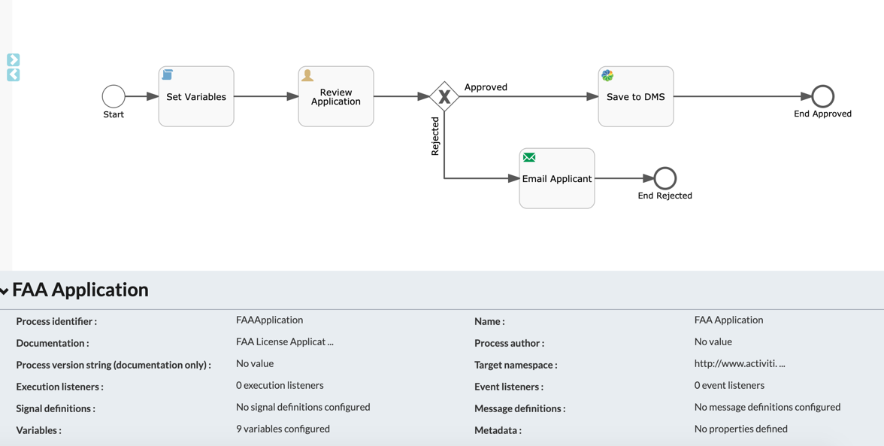
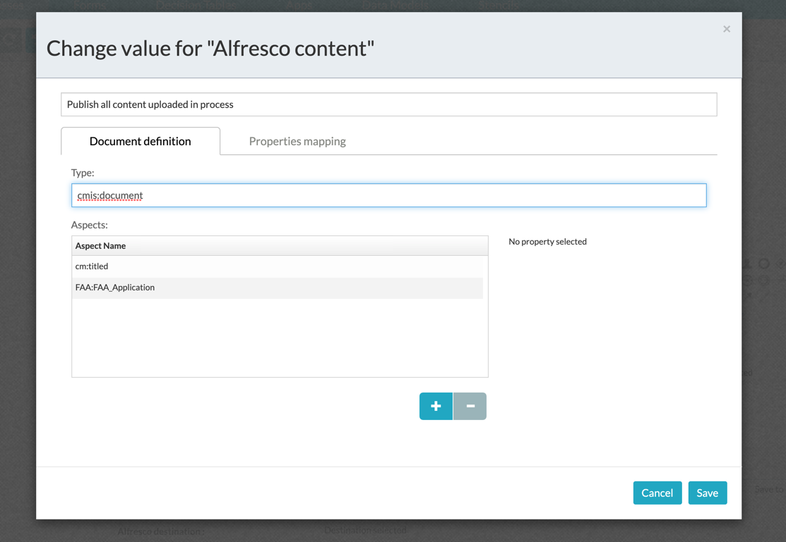
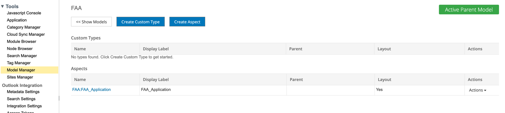
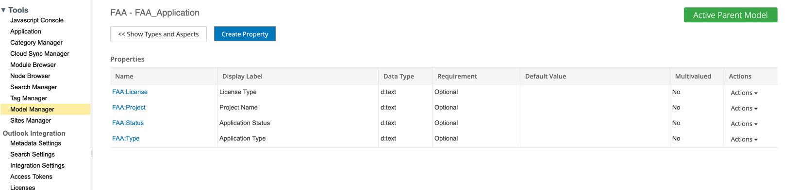
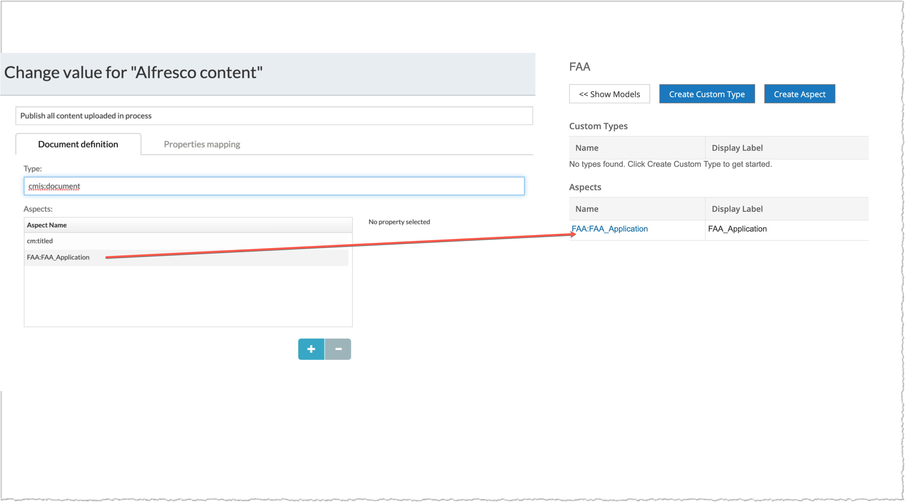
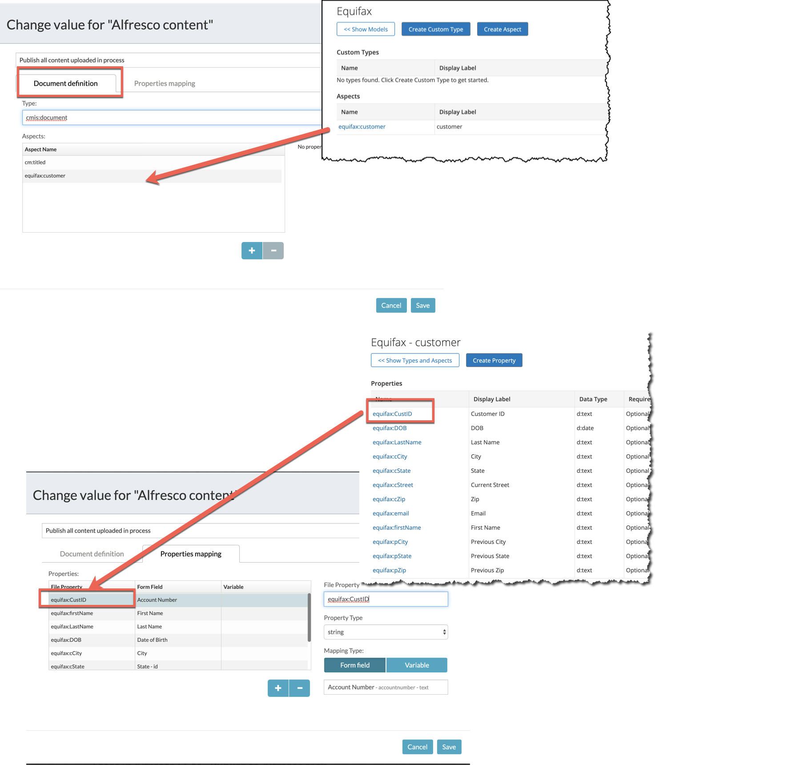

#### The project contains all the components required to set the process values as custom properties of uploaded document.

### Use-Case / Requirement
Build a process :
1. User should enter values and attach a file to a human task.
2. The process instance values should be bound as custom properties (Aspects) of the attached file in ACS.

### Prerequisites to run this demo end-2-end

* Alfresco Process Services (powered by Activiti) (Version 1.9 and above) - If you don't have it already, you can download a 30 day trial from [Alfresco Process Services (APS)](https://www.alfresco.com/products/business-process-management/alfresco-activiti).Instructions & help available at [Activiti Docs](http://docs.alfresco.com/activiti/docs/), [Alfresco BPM Community](https://community.alfresco.com/community/bpm)

## Configuration Steps

### Activiti Setup and Process Deployment
1. Import the [FAA-Application.zip](FAA-Application.zip) app available in this project into Activiti.
2. Process Flow  
3. Publish To Alfresco Task  
4. Publish Task : Document Configuration 
5. Publish Task : Properties Configuration 
6. Create Data Models in ACS Model Manager: 
7. Aspect 
8. Aspect Properties
9. Map the aspects between APS and ACS. 
10. Map the aspect properties between APS and ACS. 
11. Publish/Deploy the APS App.

### Run the DEMO

### References
1. https://docs.alfresco.com/process-services1.9/concepts/ps-create-datamodel.html
2. http://docs.alfresco.com/activiti/docs/user-guide/1.5.0/#_publish_to_alfresco