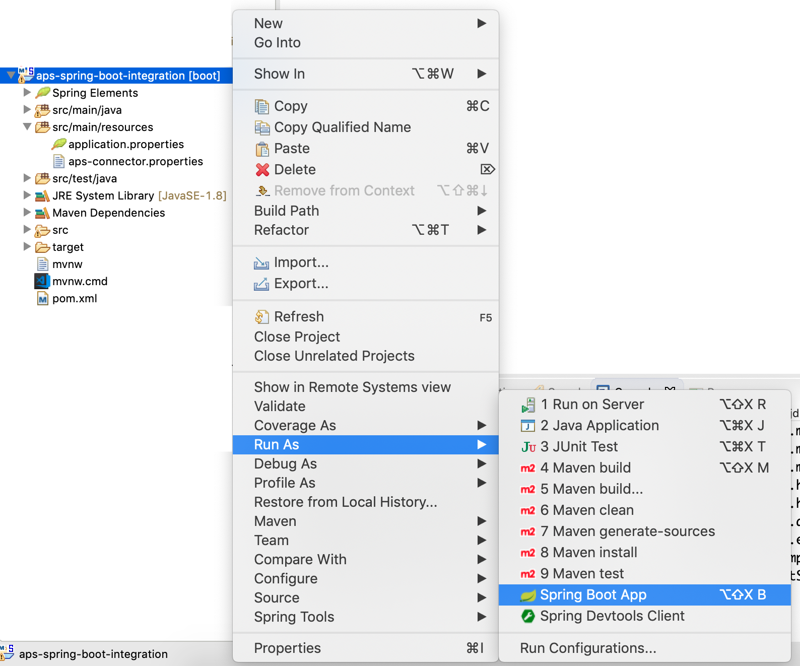

#### Example of integration between Java Spring Boot Application and APS

### Use-Case / Requirement
A Java Spring Boot application should be integrated with APS and should have the following capabilities.
1. Invoke a process instance in APS.
2. The invoked process instance should return values to the Spring Boot Application at any point of its life span.

### Design
Foolowing is the design to accomplish the requirements. 
1. The APS Process Instance is invoked from Spring Boot App by using the APS-REST API Calls. 
2. A REST API service is built using the Spring Boot App. This REST service is invoked from APS and values are passed.

### Prerequisites to run this demo end-2-end
* Alfresco Process Services (powered by Activiti) (Version 1.9 and above) - If you don't have it already, you can download a 30 day trial from [Alfresco Process Services (APS)](https://www.alfresco.com/products/business-process-management/alfresco-activiti).Instructions & help available at [Activiti Docs](http://docs.alfresco.com/activiti/docs/), [Alfresco BPM Community](https://community.alfresco.com/community/bpm)

## Configuration Steps

### Activiti Setup and Process Deployment
1. Import the  app available in this project into Activiti.
2. Process Flow.  
3. REST Configuration.      
4. Script Configuration. 
5. Java Source Code. 
<!-- 6. The JAR File.  -->
<!-- 7. Copy the jar file to tomcat-lib location. [eg: /usr/local/tomcat/webapps/activiti-app/WEB-INF/lib/] -->
6. Publish/Deploy the APS App.
7. Run as 'Spring Boot App' 
   
### Run the DEMO

### References
1. https://github.com/cijujoseph/activiti-examples/tree/master/activiti-copy-attachments-from-parent-process
2. https://www.mkyong.com/spring-boot/spring-boot-configurationproperties-example/
3. https://www.baeldung.com/properties-with-spring
4. https://spring.io/guides/gs/spring-boot/
5. https://www.edureka.co/blog/spring-boot-setup-helloworld-microservices-example/
6. http://www.springboottutorial.com/creating-spring-boot-project-with-eclipse-and-maven