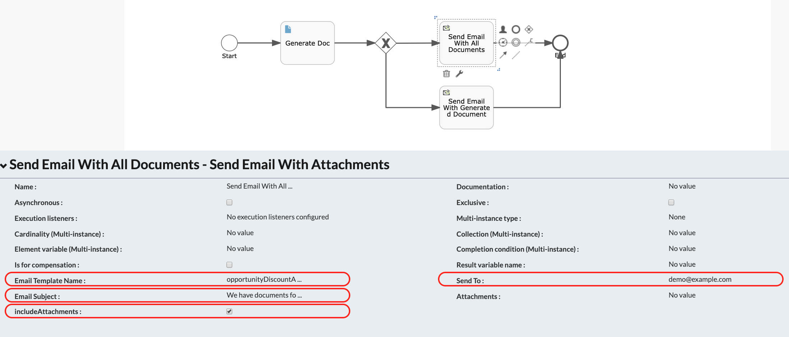
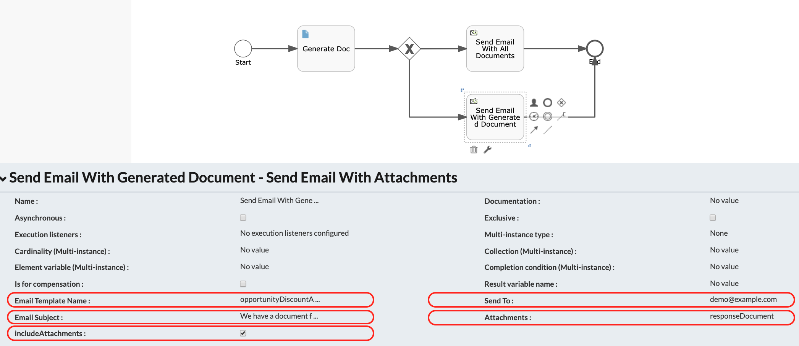
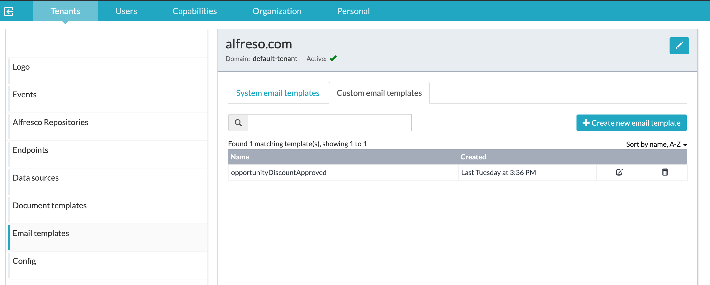
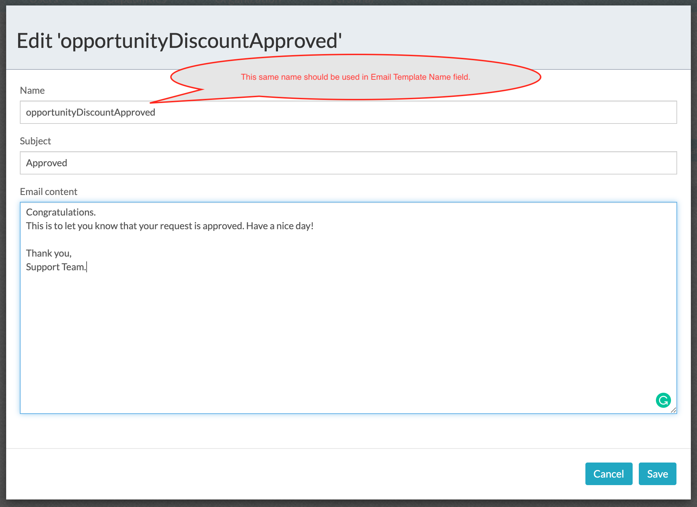

#### The project contains the customization to send email with one or more attachments.

### Use-Case / Requirement
The process workflow has to send an email to designated users attaching :
1. All documents that are uploaded and generated in process Instance
OR
2. Any one document (either generated document or an uploaded document)

### Prerequisites to run this demo end-2-end

* Alfresco Process Services (powered by Activiti) (Version 1.9 and above) - If you don't have it already, you can download a 30 day trial from [Alfresco Process Services (APS)](https://www.alfresco.com/products/business-process-management/alfresco-activiti).Instructions & help available at [Activiti Docs](http://docs.alfresco.com/activiti/docs/), [Alfresco BPM Community](https://community.alfresco.com/community/bpm)

## Configuration Steps

### Activiti Setup and Process Deployment
1. Setup Alfresco Activiti if you don't have one already. Instructions & help available at [Activiti Docs](http://docs.alfresco.com/activiti/docs/), [Alfresco BPM Community](https://community.alfresco.com/community/bpm)
2. Import the [send-email-with-attachments.zip](resources/send-email-with-attachments.zip) app available in this project into Activiti.
3. The process flow.  
4. The email task configuration if you want to send all documents in the process. 
5. The email task configuration if you want to send only one document in the process. 
6. Create an Email Template 
6. Deploy the [JAR file](resources/activiti-extension-send-email-with-attachments-1.0-SNAPSHOT.jar) to the activiti-app webapp's WEB-INF/lib folder.
   eg: /usr/local/tomcat/webapps/activiti-app/WEB-INF/lib
7. Publish/Deploy the App.

### Please follow these steps if you want to update the extension
1. [Setting up an Extension Project](https://hub.alfresco.com/t5/alfresco-process-services/activiti-enterprise-developer-series-setting-up-an-extension/ba-p/287187)
2. The source code of the extension is available [here](resources/code).

### Run the DEMO

### References
1. https://github.com/cijujoseph/activiti-examples/tree/master/enterprise-features-aps-demo
