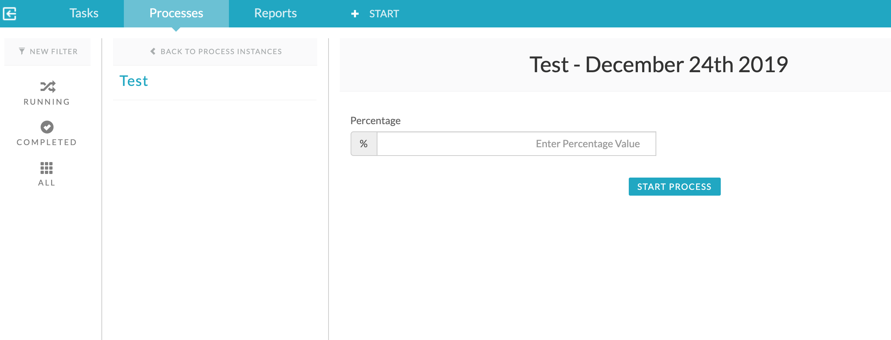
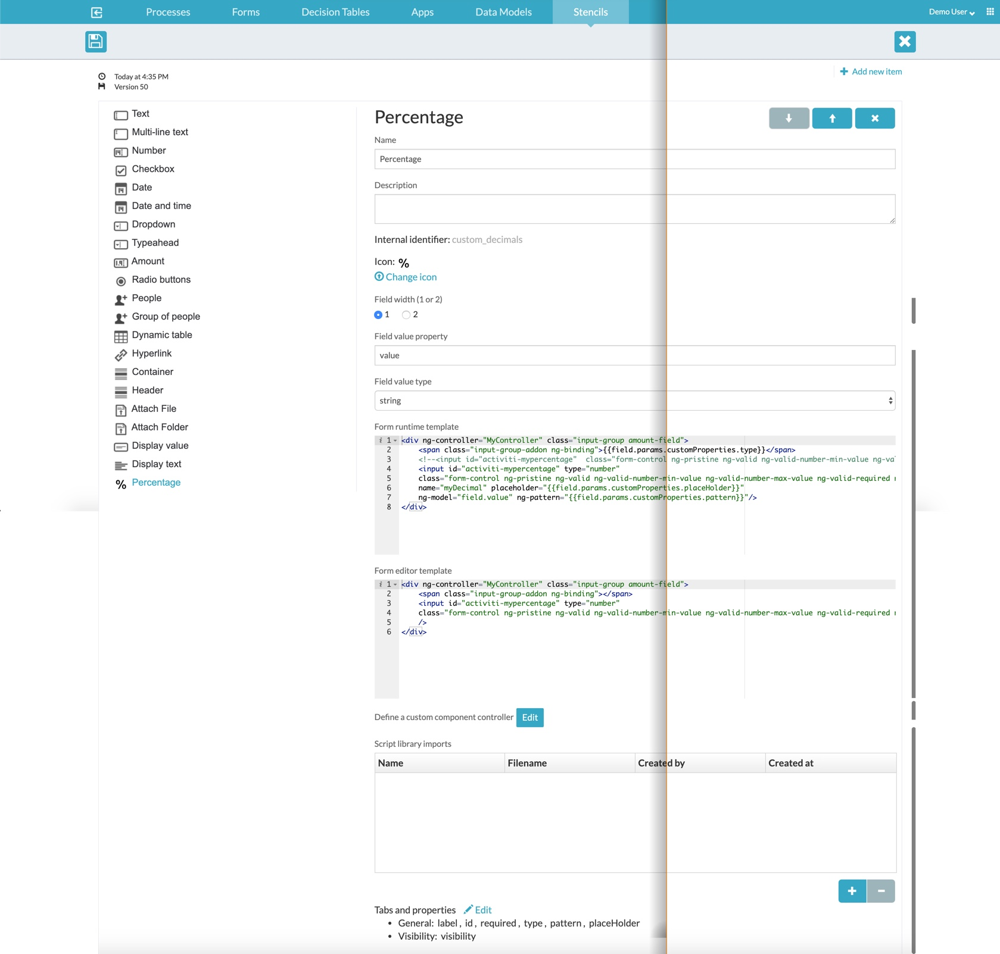

#### FORM STENCILS for capturing percentage values in APS.

### Use case
* Need an APS stencil to capture custom values like percentage.
* The decimal places that can be captured should be configurable.


## Form runtime template
```html
<div ng-controller="MyController" class="input-group amount-field">
    <span class="input-group-addon ng-binding">{{field.params.customProperties.type}}</span>

    <input id="activiti-mypercentage" type="number"
    class="form-control ng-pristine ng-valid ng-valid-number-min-value ng-valid-number-max-value ng-valid-required ng-touched"
    name="myDecimal" placeholder="{{field.params.customProperties.placeHolder}}"
    ng-model="field.value" ng-pattern="{{field.params.customProperties.pattern}}"/>

</div>
```

## Runtime View
A runtime image of this stencil


## Stencil
Stencil Image

* [A sample process app can be downloaded here.](Kindred-App.zip)
* [The stencil can be downloaded here.](Kindred-Stencil.zip)

## References
1. https://docs.alfresco.com/process-services1.6/topics/custom_form_fields.html
2. https://docs.alfresco.com/process-services1.6/topics/example_3_dynamic_pie_chart.html
3. https://gsferreira.com/archive/2015/02/angularjs-input-number-with-two-decimal-places/
4. https://github.com/cijujoseph/activiti-examples/tree/master/stencil-samples
