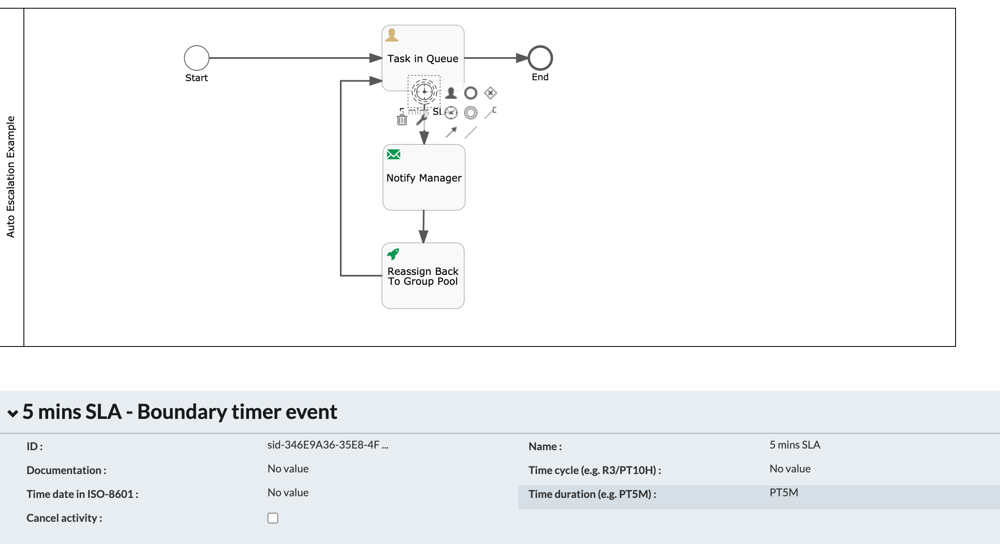

#### The project contains all the components required to automatically re-assign to the Group Pool upon SLA expiry

### Use-Case / Requirement

Build a process :

1. A group (eg: hr-group) should have more than one members.
2. A task is assigned to `hr-group`
3. One of the members claims that task and it has an `SLA` of 5 minutes.
4. The member `could not complete` the task in the specified time.
5. Upon SLA epiry, the system should trigger an email.
6. Upon SLA epiry, the system should automatically reassign the task back to the Group Pool.

### Prerequisites to run this demo end-2-end

* Alfresco Process Services (powered by Activiti) (Version 1.11 and above) - If you don't have it already, you can download a 30 day trial from [Alfresco Process Services (APS)](https://www.alfresco.com/products/business-process-management/alfresco-activiti).
* Instructions & help available at [Activiti Docs](http://docs.alfresco.com/activiti/docs/), [Alfresco BPM Community](https://community.alfresco.com/community/bpm)

## Configuration Steps

### Activiti Setup and Process Deployment

1. Import the [Reassign-Task-SLA-App.zip](Reassign-Task-SLA-App.zip) app available in this project into APS.
2. The process flow.  

3. Configure `Task In Queue` Assignment Property and make it assigned to `hr-group`.

   
   

4. Configure the SLA using a `Boundary Timer Event`
   

5. REST Call to `Uncalim Task` and `Reassign Back to Group Pool`.
   
   

6. Setup a group for testing purpose.

   

7. Publish/Deploy the App.

### Run the DEMO

1. Login as one of the group member `Demo User`.

   

2. Create a Process Instance.

   

3. Login as a member of `hr-group` and `Claim` the task.
   
   

4. After 5 minutes, the SLA is triggered and the task in unclaimed and assiged back to Group Pool

   

5. The task is now back to the group pool for team members to claim.   

### References

1. REST API - <https://activiti.alfresco.com/activiti-app/api-explorer.html#!/task-actions/unclaimTaskUsingPUT>
2. <http://docs.alfresco.com/activiti/docs/user-guide/1.5.0/>
3. <http://docs.alfresco.com/activiti/docs/user-guide/1.5.0/#_assigning_tasks>
4. <https://docs.alfresco.com/activiti/docs/dev-guide/1.5.0/>
