#### The project contains all the components required to re-assign a Human Task to a different member upon SLA expiry.

### Use-Case / Requirement
Build a process :
1. A group (eg: hr-group) should have more than one members.
2. One of the members receives a task that has an `SLA` of 5 minutes.
3. The member `could not complete` the task in the specified time.
4. The `SLA` should trigger a notification to `Group Manager` asking to reassign the task.
5. The `Group Manager` should be able to `reassign` the task to a `different user`.


### Prerequisites to run this demo end-2-end

* Alfresco Process Services (powered by Activiti) (Version 1.11 and above) - If you don't have it already, you can download a 30 day trial from [Alfresco Process Services (APS)](https://www.alfresco.com/products/business-process-management/alfresco-activiti).
* Instructions & help available at [Activiti Docs](http://docs.alfresco.com/activiti/docs/), [Alfresco BPM Community](https://community.alfresco.com/community/bpm)


## Configuration Steps

### Activiti Setup and Process Deployment
1. Import the [Reassign-Task-SLA-App.zip](Reassign-Task-SLA-App.zip) app available in this project into APS.
2. The process flow.  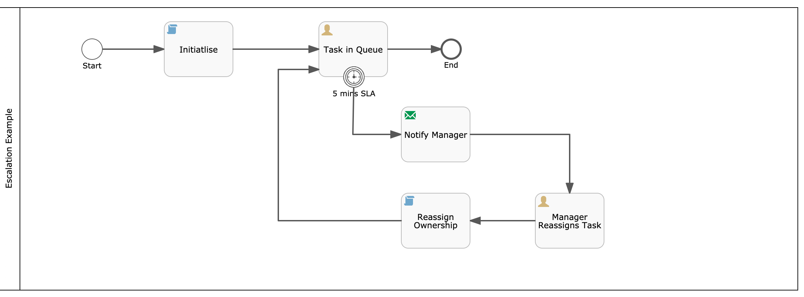
3. The Groovy script configuration.
   ```
    import com.activiti.domain.idm.User;
    import com.activiti.domain.idm.Group;
    import com.activiti.security.SecurityUtils;
    import com.activiti.service.idm.UserServiceImpl;
    
    def assignee = "gcambra@example.com"; //temp hard-coding
    def userId = String.valueOf(userService.findUserByEmail(assignee).getId());
    
    execution.setVariable('taskassignee', userId);
    ```

4. Configure `Task In Queue` Assignment Property and make it assigned to `${taskassignee}` variable.

   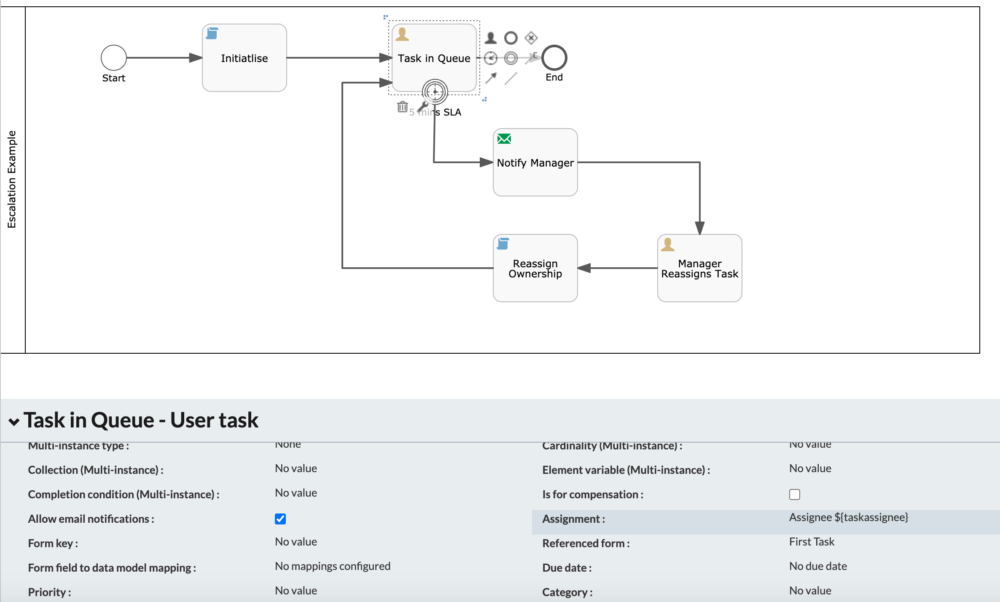
   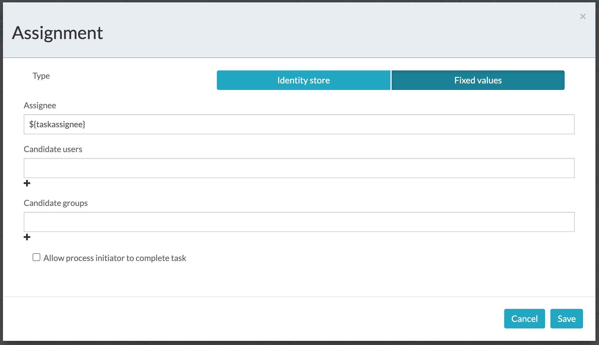

5. Configure the SLA using a `Boundary Timer Event`
   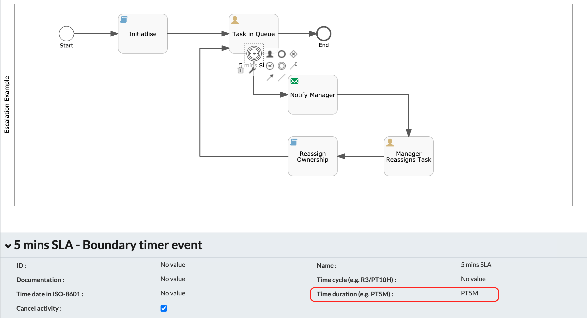

6. Manager's Task to change the ownership.
   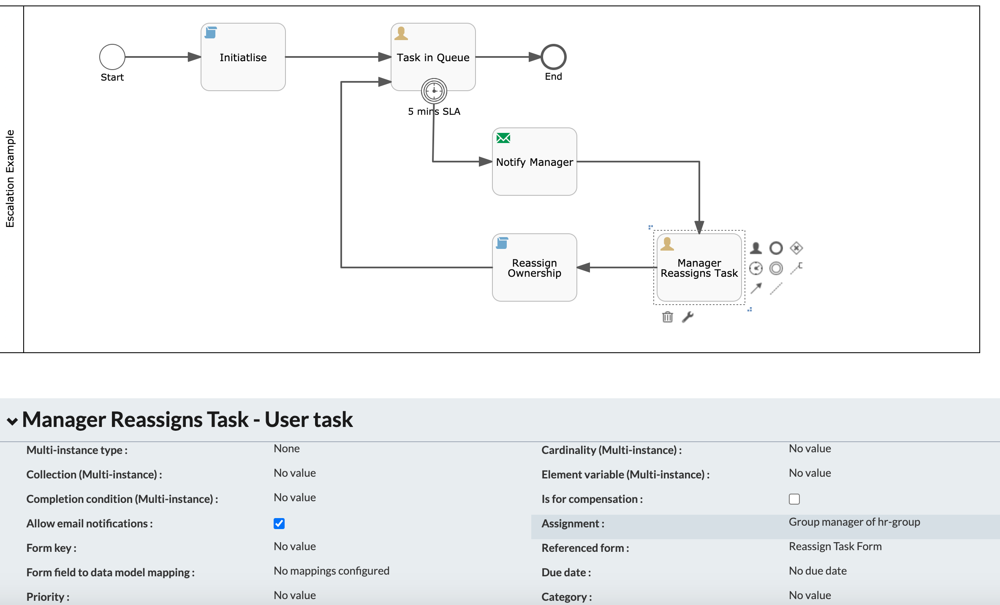

7. Groovy script for changing ownership.
   ```
   def reassignedtaskassignee = execution.getVariable("reassignedtaskassignee");
   execution.setVariable('taskassignee', reassignedtaskassignee);
   ```

8. Setup a group for testing purpose.

   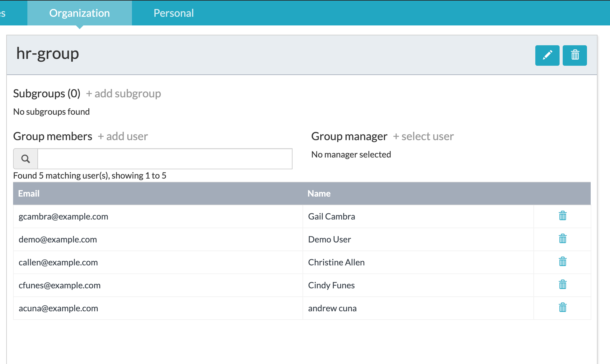

9. Publish/Deploy the App.

### Run the DEMO

1. Login as one of the group member `Demo User`.

   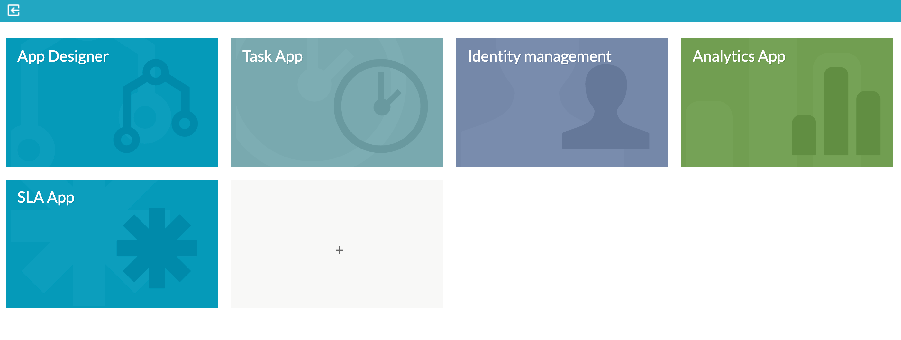

2. Create a Process Instance.

   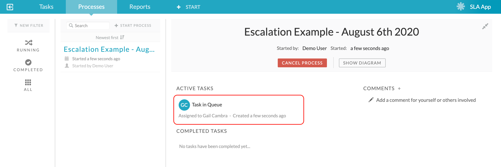

3. After 5 minutes, the SLA is triggered and Manager receives a task.

   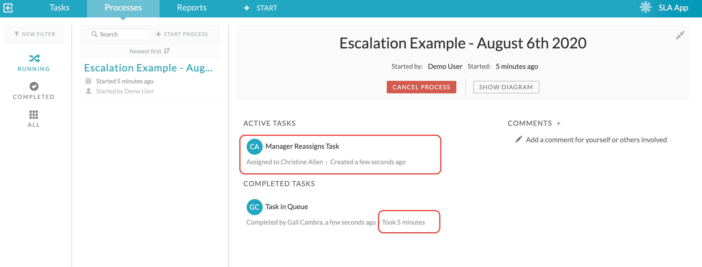

4. Manager logs in and works on the Reassignment Task

   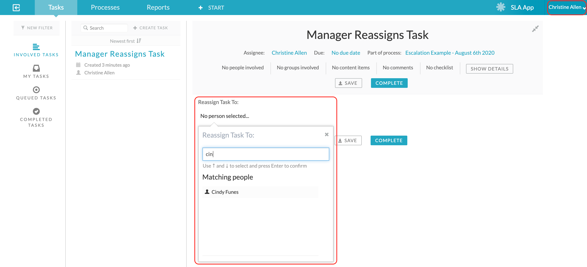

5. The new user logs in and sees the task reassigned.
   
   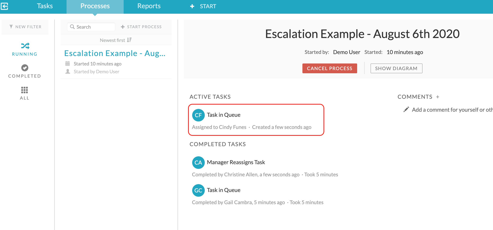


### Tip of the day
1. There are beans and services created and available through out activiti and APS code.
   1. com.activiti.service.idm.UserServiceImpl.java - Beans
   2. com.activiti.service.idm.GroupServiceImpl.java - Beans
2. Those files with `impl` in their file name are the implementation (beans) of corresponding interface/services.
   eg: UserServiceImpl.java is the implementation for UserService.java
3. The UserServiceImpl.java implementation file has a `@Service` name.
   1. So invoking points in APS will be the value of `@Service`.
   2. eg: UserServiceImpl.java has the service name as `@Service("userService")`.
   3. In APS, this service is available as ` List<User> users = userService.getAllUsers(0,999,tenantId);`
4. The GroupServiceImpl.java implementation file does not have a `@Service` name.
   1. No service name is mentioned in `@Service` of GroupServiceImpl.java.
   2. Since service name is empty, the implementation file's name, with first letter in lower case, is assigned as default service name.
   3. Invoking points in APS will be `groupServiceImpl`.
   4. In APS, this service is available as ` List<Group> groups = groupServiceImpl.getGroupByNameAndTenantId('FBIAnalyst', 1L);`

### References
1. http://docs.alfresco.com/activiti/docs/user-guide/1.5.0/
2. http://docs.alfresco.com/activiti/docs/user-guide/1.5.0/#_assigning_tasks
3. https://docs.alfresco.com/activiti/docs/dev-guide/1.5.0/
