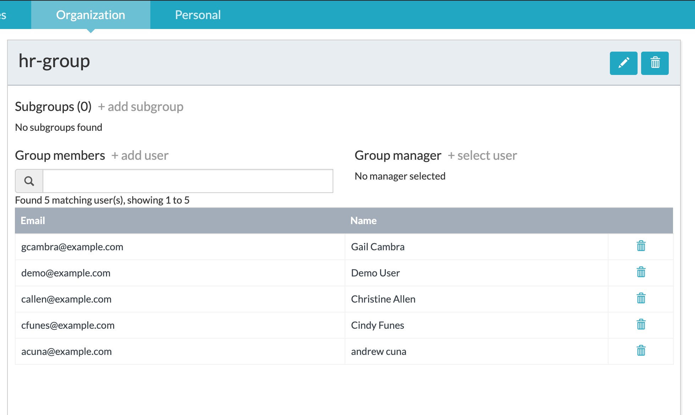

#### The project contains all the components required to assign an APS human task to one or more groups.

### Use-Case / Requirement
Build a process :
1. A group (eg: hr-group) should have more than one members.
2. One member should submit a request which is followed by a `Review Task`.
3. The `Review Task` should be available for all the group members other than the submitter to work.


### Prerequisites to run this demo end-2-end

* Alfresco Process Services (powered by Activiti) (Version 1.9 and above) - If you don't have it already, you can download a 30 day trial from [Alfresco Process Services (APS)](https://www.alfresco.com/products/business-process-management/alfresco-activiti).Instructions & help available at [Activiti Docs](http://docs.alfresco.com/activiti/docs/), [Alfresco BPM Community](https://community.alfresco.com/community/bpm)


## Configuration Steps

### Activiti Setup and Process Deployment
1. Import the [Assign-Task-To-Filtered-Users.zip](Assign-Task-To-Filtered-Users.zip) app available in this project into APS.
2. The process flow.  
3. The Groovy script configuration.
   ```
    import com.activiti.domain.idm.User;
    import com.activiti.domain.idm.Group;
    import com.activiti.security.SecurityUtils;
    import com.activiti.service.idm.GroupServiceImpl;

    ArrayList userIdList = new ArrayList();
    User currentUser = SecurityUtils.getCurrentUserObject();
    Long tenantId = currentUser.getTenantId();

    List<Group> groups = groupServiceImpl.getGroupByNameAndTenantId('hr-group', tenantId);  //group name is temp hardcoded
    Group group = groupServiceImpl.getFunctionalGroup(groups[0].getId());

    for (User groupUser : group.getUsers()) {
       if(!currentUser.getId().equals(groupUser.getId())){
          userIdList.add(String.valueOf(groupUser.getId()));
       }
    }

    execution.setVariable('assigneeUserList', userIdList);
    ```

4. Configure `Review Task` Assignment Property.
   
   

5. Setup a group for testing purpose.
   

6. Publish/Deploy the App.

### Run the DEMO

1. Login as one of the group member `Demo User`.
   

2. Submit the request.
   

3. Process advances to `Review Task`.
   

4. Verify and confirm that `Review Task` is now available for members other than submitter.
   

### Tip of the day
1. There are beans and services created and available through out activiti and APS code.
   1. com.activiti.service.idm.UserServiceImpl.java - Beans
   2. com.activiti.service.idm.GroupServiceImpl.java - Beans
2. Those files with `impl` in their file name are the implementation (beans) of corresponding interface/services.
   eg: UserServiceImpl.java is the implementation for UserService.java
3. The UserServiceImpl.java implementation file has a `@Service` name.
   1. So invoking points in APS will be the value of `@Service`.
   2. eg: UserServiceImpl.java has the service name as `@Service("userService")`.
   3. In APS, this service is available as ` List<User> users = userService.getAllUsers(0,999,tenantId);`
4. The GroupServiceImpl.java implementation file does not have a `@Service` name.
   1. No service name is mentioned in `@Service` of GroupServiceImpl.java.
   2. Since service name is empty, the implementation file's name, with first letter in lower case, is assigned as default service name.
   3. Invoking points in APS will be `groupServiceImpl`.
   4. In APS, this service is available as ` List<Group> groups = groupServiceImpl.getGroupByNameAndTenantId('FBIAnalyst', 1L);`

### References
1. http://docs.alfresco.com/activiti/docs/user-guide/1.5.0/
2. http://docs.alfresco.com/activiti/docs/user-guide/1.5.0/#_assigning_tasks
