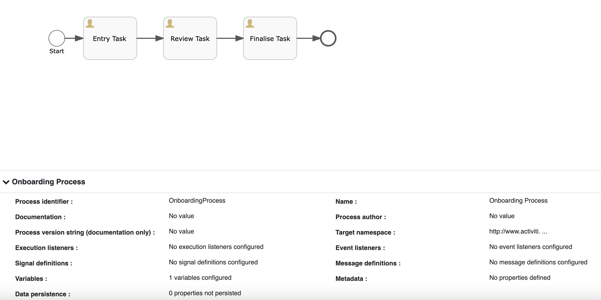
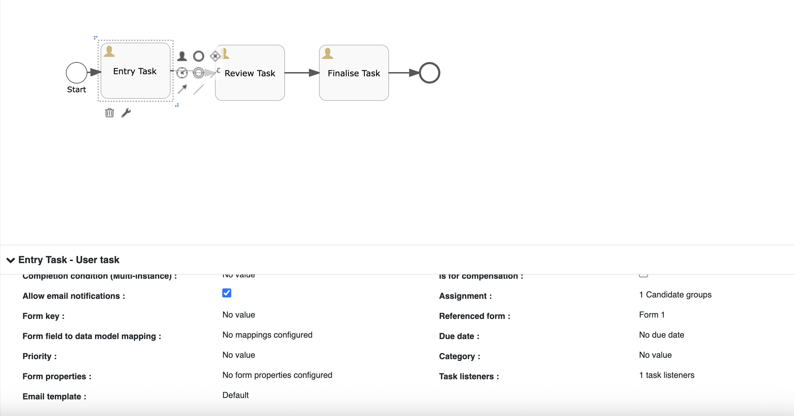
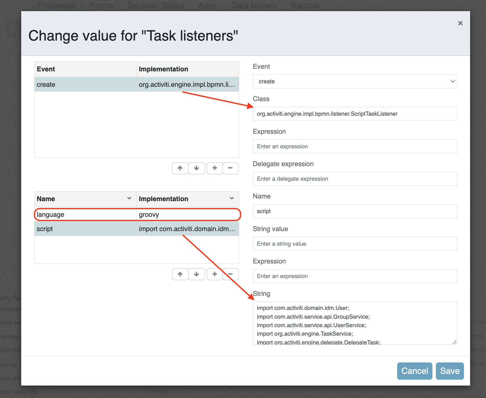
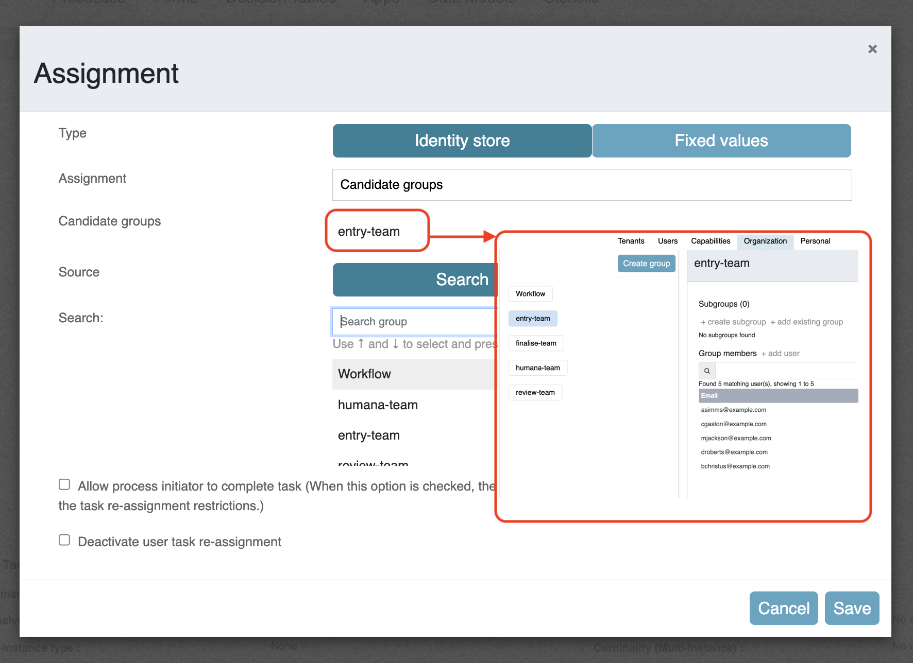
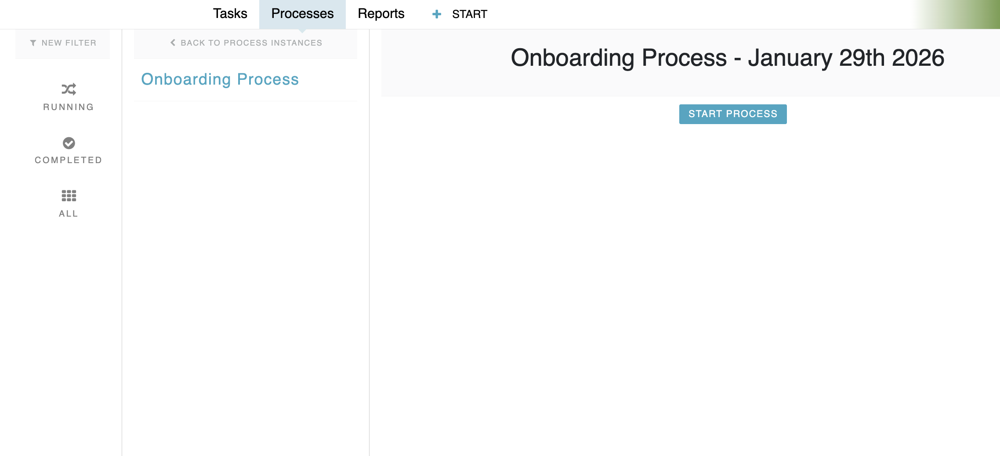
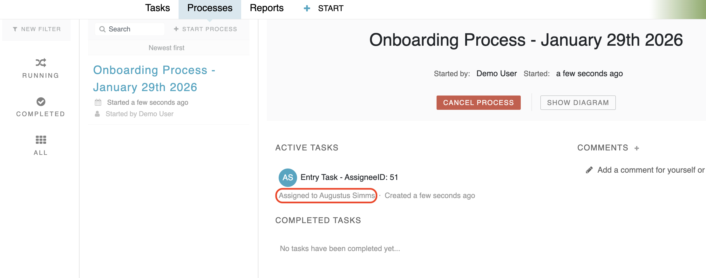
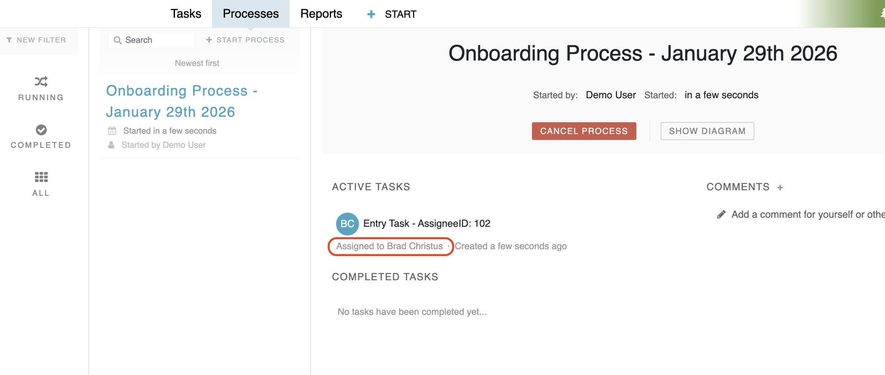

#### The project contains all the components required to create task assignments based on Round-Robin logic

### Use-Case / Requirement

Build a process :

1. Tasks of the same human activity should be assigned to a group. But in runtime, the tasks should be assigned to users of that group in a Round Robin fashion.

### Prerequisites to run this demo end-2-end

* Alfresco Process Services (powered by Activiti) (Version 1.9 and above) - If you don't have it already, you can download a 30 day trial from [Alfresco Process Services (APS)](https://www.alfresco.com/products/business-process-management/alfresco-activiti).Instructions & help available at [Activiti Docs](http://docs.alfresco.com/activiti/docs/), [Alfresco BPM Community](https://community.alfresco.com/community/bpm)

## Configuration Steps

### Activiti Setup and Process Deployment

1. Import the [human-app.zip](assets/human-app.zip) app available in this project into APS.
2. The process flow.  
3. The script task listener.  
   ```javascript
   org.activiti.engine.impl.bpmn.listener.ScriptTaskListener
   ```
4. The task listener configuration.   
5. The Group has following members.   
5. The groovy script configuration.

   ``` groovy
      import com.activiti.domain.idm.User;
      import com.activiti.service.api.GroupService;
      import com.activiti.service.api.UserService;
      import org.activiti.engine.TaskService;
      import org.activiti.engine.delegate.DelegateTask;
      import org.activiti.engine.delegate.TaskListener;
      import org.activiti.engine.task.IdentityLink;
      import org.activiti.engine.task.Task;
      import org.springframework.beans.factory.annotation.Autowired;
      import org.springframework.stereotype.Component;

      import java.util.ArrayList;
      import java.util.Collections;
      import java.util.List;
      import java.util.Set;

      Set<IdentityLink> candidates = task.getCandidates();
      ArrayList<String> userArray = new ArrayList<String>();

      for (IdentityLink idntyLink : candidates) {

         if (idntyLink.getGroupId() != null) {
            Set<User> users = groupServiceImpl.getFunctionalGroup(Long.parseLong(idntyLink.getGroupId())).getUsers();

            for (User user : users) {
                  if (!userArray.contains(user.getEmail())) {
                     userArray.add(user.getEmail());
                  }
            }
         }
      }

      Collections.sort(userArray);
      String taskDefKey = task.getTaskDefinitionKey();

      out.println("Task Definition Key: " + taskDefKey);

      List<Task> taskList = taskService.createTaskQuery().taskDefinitionKey(taskDefKey).taskAssigneeLike("%")
            .orderByTaskCreateTime().desc().list();
      String nextAssignee;
      if (taskList.size() > 0) {
         String lastAssignee = userService.getUser(Long.parseLong(taskList.get(0).getAssignee())).getEmail();
         out.println("Last Assignee: " + lastAssignee);
         int lastAssigneeIndex = userArray.indexOf(lastAssignee);
         if (lastAssigneeIndex + 1 < userArray.size()) {
            nextAssignee = Long.toString(userService.findUserByEmail(userArray.get(lastAssigneeIndex + 1)).getId());
         } else {
            nextAssignee = Long.toString(userService.findUserByEmail(userArray.get(0)).getId());
         }
      } else {
         nextAssignee = Long.toString(userService.findUserByEmail(userArray.get(0)).getId());
      }
      task.setAssignee(nextAssignee);
      task.setName(task.getName() + " - AssigneeID: " + nextAssignee);
    ```

6. Publish/Deploy the App.

### Run the DEMO

1. Login to APS. Select the Process App. Create 'Onboarding Process'.

   

2. First task automatically assigns to the first user.

   

   Second task automatically assigns to the second user.. and keeps going on in a Round Robin pattern.
   
   


### References

1. <http://docs.alfresco.com/activiti/docs/user-guide/1.5.0/>
2. <http://docs.alfresco.com/activiti/docs/user-guide/1.5.0/#_assigning_tasks>
