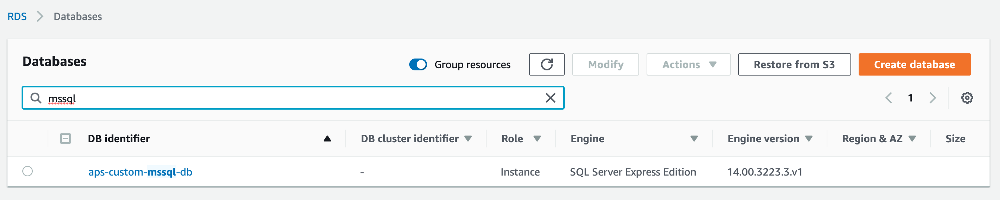
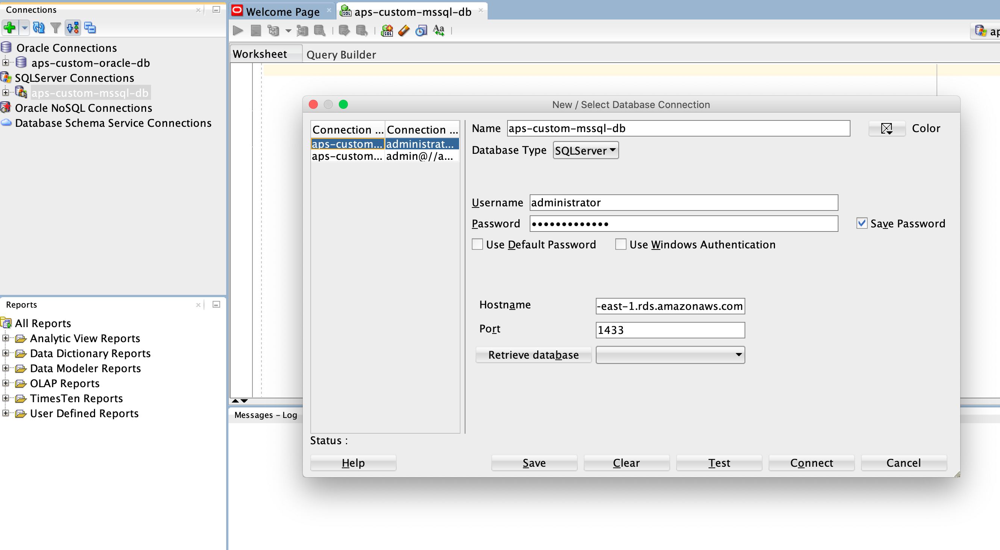
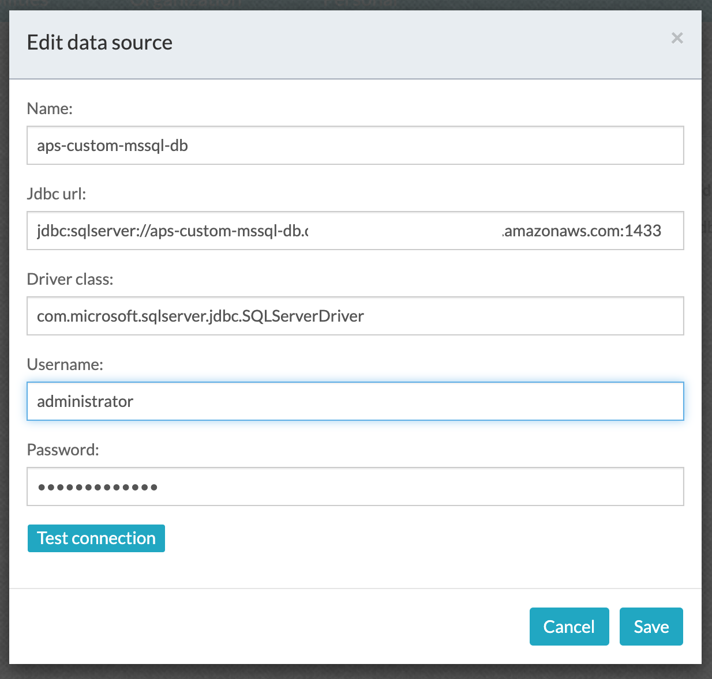

#### The project contains all the components required to create an integration to an Enterprise System Of Records (AWS Oracle RDS)

### Use-Case / Requirement
Build a process to create an integration to MSSQL Database serving as [Enterprise System Of Records](https://en.wikipedia.org/wiki/System_of_record).


### Prerequisites to run this demo end-2-end

* Alfresco Process Services (powered by Activiti) (Version 1.9 and above) - If you don't have it already, you can download a 30 day trial from [Alfresco Process Services (APS)](https://www.alfresco.com/products/business-process-management/alfresco-activiti).Instructions & help available at [Activiti Docs](http://docs.alfresco.com/activiti/docs/), [Alfresco BPM Community](https://community.alfresco.com/community/bpm)
* The Oracle Database is created as AWS RDS.


## Configuration Steps

### Create the AWS RDS MSSQL DB
Follow the steps per [AWS Documentation](https://docs.aws.amazon.com/AmazonRDS/latest/UserGuide/CHAP_GettingStarted.CreatingConnecting.SQLServer.html) to create an [AWS MSSQL RDS](https://aws.amazon.com/rds/sqlserver/)


### Connect to the AWS RDS Oracle DB using SQL Developer

Tip: Follow this [blog post](http://www.snapdba.com/2013/10/using-sql-developer-to-connect-to-sql-server-databases/#.XgouWNZKjys) to add MSSQL DB to SQL Developer.

### Create datasource for AWS RDS Oracle DB in APS
1. Download and unzip the sqljdbc42.jar file from [here](http://www.java2s.com/Code/JarDownload/sqljdbc4/sqljdbc4-2.0.jar.zip)
2. Copy the [sqljdbc42.jar](sqljdbc42.jar) to tomcat/lib location of APS server. eg: /usr/share/tomcat/lib/sqljdbc42.jar
3. Restart APS
4. Create data source using the values mentioned in [APS article](https://github.com/sherrymax/aps-examples/tree/master/aps-custom-database-integration#mssql-db)
5. Datasource screenshot 

   ```
    Name : aps-custom-mssql-db
    JDBC URL : jdbc:sqlserver://<aws-db-end-point>:<aws-port>
    Driver Class : com.microsoft.sqlserver.jdbc.SQLServerDriver
    User Name : db-username
    Password : db-password
    ```
    Some connections can use following JDBC URL

    ```
    JDBC URL : jdbc:sqlserver://<aws-db-end-point>:<aws-port>;database=<aws-mssql-db-name>
    ```


### Process App Setup and Deployment
1. Import the [MSSQL-Database-Operations.zip](MSSQL-Database-Operations.zip) app available in this project into Activiti.
2. Process Flow.  
3. Data Model Configuration in Process. 
4. Data Model Configuration in Application.   
5. Publish/Deploy the APS App.


### Run the DEMO
1. Verify the data entered through the APS form: 
1. Verify the data in AWS RDS MSSQL Database using SQL Developer: 

### References
1. http://docs.alfresco.com/activiti/docs/user-guide/1.5.0/
2. http://docs.alfresco.com/activiti/docs/user-guide/1.5.0/#_connecting_your_data_model_to_a_relational_database
3. https://www.activiti.org/userguide/index.html#supporteddatabases
4. https://oskar.idashboards.com/hc/en-us/articles/227563548-Amazon-RDS-MS-SQL-Data-Source
5. https://docs.aws.amazon.com/AmazonRDS/latest/UserGuide/CHAP_GettingStarted.CreatingConnecting.SQLServer.html
6. http://www.snapdba.com/2013/10/using-sql-developer-to-connect-to-sql-server-databases/#.XgouWNZKjys
7. https://djiang.wordpress.com/2007/02/27/using-oracle-sqldeveloper-to-access-sqlserver/
